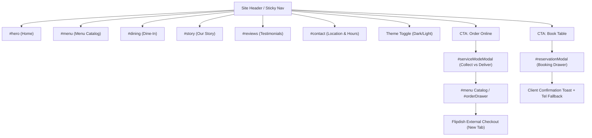

# Naveen's Kitchen Lezzetli Restaurant Website — Developer Handoff & Technical Documentation

---

## Section 1: Project Overview

### 1.1 Executive Summary
* **Project Name:** Naveen's Kitchen Lezzetli Restaurant Website
* **Website Purpose:** Digital storefront, brand showcase, menu discovery, table booking inquiry funnel, and online takeaway/delivery routing for Naveen's Kitchen Lezzetli — an authentic Middle Eastern charcoal grill, Hyderabadi Dum and South Indian cuisine restaurant situated at Unit 3, Limerick Lane, Newbridge, Co. Kildare, Ireland (Tel: `045 494056`).
* **Technology Stack:** Pure client-side static web architecture:
  * **HTML5:** Semantic markup, dialog overlays, side drawers, and interactive lists.
  * **CSS3:** Vanilla CSS with custom properties (`:root[data-theme="dark"]` and `[data-theme="light"]`), CSS Grid, Flexbox, media queries, and hardware-accelerated animations.
  * **JavaScript:** Vanilla ES6+ (no frameworks, no compile steps, no runtime libraries).
  * **Typography:** Google Fonts (`Cinzel`, `Playfair Display`, `Outfit`, `Plus Jakarta Sans`) loaded via CSS `@import`.
  * **Media & Imagery:** Unsplash CDN photography for food presentation, hero textures, and story features.
* **Project Architecture:** Single-Page Application (SPA) structured as a continuous vertical scroll experience complemented by modal dialogs and slide-over / bottom-sheet drawers.
* **Hosting & CI/CD:** Hosted statically on Vercel, with automated continuous deployments triggered by Git pushes to the `main` branch.

### 1.2 Implemented Feature Matrix

| Status Category | Feature & Subsystem | Code Verification Evidence |
| :--- | :--- | :--- |
| **Implemented** | **Dual Theme Engine:** Dark Mode (Evening Charcoal & Embers) and Light Mode (Day Dining Ivory/Cream) with `localStorage` persistence and live icon updates. | Verified in `js/app.js` (`initTheme`, `applyTheme`) and `css/styles.css` (lines 10–120). |
| **Implemented** | **Dynamic Menu Catalog & Filtering:** Filter by 6 food categories, 4 dietary tags (All, Veg, Spicy, Halal), and real-time live keyword search. | Verified in `js/app.js` (`initMenuFilters`, `renderMenu`) and `index.html` (`#menuGrid`). |
| **Implemented** | **Item Customizer System:** Multi-select salads (max 4), required single-select house sauce, paid add-on modifiers, real-time total updates, and quantity stepper. | Verified in `index.html` (`#itemCustomizerModal`), `css/styles.css` (lines 3540–3850), and `js/app.js` (`openCustomizer`). |
| **Implemented** | **Multi-Item Order Bag & Cart Engine:** Line item modifier hashing, quantity adjustment, item removal, coupon engine (`LEZZETLI10` for 10% off), delivery fee calculation, and packaging fee. | Verified in `js/app.js` (`orderCart`, `syncCartUI`, `renderOrderModalCart`). |
| **Implemented** | **Service Mode Selector:** Modal choosing between Collection (15–20 min) and Home Delivery (35–45 min), synchronizing global `orderState`. | Verified in `index.html` (`#serviceModeModal`) and `js/app.js` (`initServiceModeModal`). |
| **Implemented** | **Flipdish Checkout Handoff:** Automatic routing from the order drawer to verified collection or delivery checkout endpoints on Flipdish in a new browser tab. | Verified in `js/app.js` (lines 1244–1254). |
| **Implemented** | **Mobile-Native Bottom Sheets & Gesture Dismissal:** On screens `<= 640px`, all modals and drawers convert into bottom sheets; close buttons are hidden; 48×5px grab handle supports tap dismiss and touch swipe-down dismiss (`> 35px` delta). | Verified in `css/styles.css` (`@media (max-width: 640px)`) and `js/app.js` (lines 1007–1045). |
| **Implemented** | **Dine-In Table Reservation Drawer:** Slide-over drawer on desktop (500px) and bottom sheet on mobile, with party size, date picker, time slot selector, contact inputs, and direct host telephone callout. | Verified in `index.html` (`#reservationModal`) and `css/styles.css` (lines 2486–2520). |
| **Implemented** | **Persistent Floating Order Summary Tray:** Fixed floating pill displaying item count, subtotal, and "View Bag" CTA that appears when cart count > 0. | Verified in `index.html` (`#floatingOrderTray`) and `css/styles.css` (lines 2688–2799). |
| **Implemented** | **Scroll Depth Progress Bar:** Fixed 3px gold bar at the top of the viewport tracking scroll progress. | Verified in `index.html` (`#scrollProgressBar`) and `js/app.js` (`initScrollAnimations`). |
| **Partially Implemented** | **Table Booking Submission:** Form validates inputs, triggers a confirmation toast, and resets fields, but **does not post to an automated backend database or table booking API**. Provides direct phone fallback (`tel:045494056`). | Verified in `js/app.js` (lines 1060–1075). |
| **Partially Implemented** | **Social & App Store Links:** Footer social icons link to root provider domains (`facebook.com`, `instagram.com`, `tripadvisor.com`). Mobile app store download buttons in `#app-download` use placeholder `#` anchors. | Verified in `index.html` (lines 790–798, 625–645). |
| **Not Implemented** | **Native Payment Gateway / Credit Card Processing:** No credit card inputs or Stripe/PayPal SDKs exist in this codebase. Financial transactions are delegated to **Flipdish**. | Verified by absence of payment tokens or card fields. |
| **Not Implemented** | **User Accounts / Customer Authentication:** No login, password, or profile databases exist. State is strictly held in client `localStorage` and memory. | Verified by codebase architecture. |

---

## Section 2: Project File & Folder Structure

### 2.1 File System Map

```
project-lezzetli/
├── .gitignore                                              # Version control exclusion list
├── index.html                                              # Master single-page DOM, modals, and drawers
├── css/
│   └── styles.css                                          # Design tokens, utility classes, components, media queries
├── js/
│   └── app.js                                              # Application logic, menu dataset, cart engine, event handlers
├── design-system.md                                        # Design tokens, typography scale, and styling guide
├── DEVELOPER_HANDOFF.md                                    # This comprehensive technical handoff document
├── validation.md                                           # UX validation matrix & audit records
├── lezzetli_current_website_understanding_and_ux_audit.md  # Legacy site benchmark documentation
└── exsisting Product reference files/                      # Reference PDFs and screenshots from original site
```

### 2.2 File Inventory & Technical Roles

| File / Folder | Exact File Path | Purpose in Architecture | Key Relationships |
| :--- | :--- | :--- | :--- |
| `index.html` | `/index.html` | Defines the entire DOM hierarchy, semantic sections, header, navigation drawers, and modal containers. | Links to `css/styles.css?v=2.5` and `js/app.js`. Embeds Google Maps iframe. |
| `styles.css` | `/css/styles.css` | Contains design tokens, global resets, typography definitions, component styles, theme variables, and responsive breakpoints. | Applied across `index.html`. Imports Google Fonts (`Cinzel`, `Outfit`, `Playfair Display`). |
| `app.js` | `/js/app.js` | Manages theme switching, menu filtering, item customization, cart calculations, drawer visibility, focus trapping, and gestures. | Binds to IDs and classes in `index.html`. Manipulates classes defined in `css/styles.css`. |
| `design-system.md` | `/design-system.md` | Architectural specification for design tokens, contrast ratios, and component rules. | Documentation reference for frontend engineers. |
| `.gitignore` | `/.gitignore` | Specifies files ignored by Git (OS artifacts, IDE settings, temporary files). | Governs Git repository tracking. |

### 2.3 How to Locate and Modify System Features

* **Modifying Page Text & Content:** Open `index.html` and search for section IDs: `#hero`, `#menu`, `#story`, `#dining`, `#reviews`, `#app-download`, or `#contact`.
* **Updating Menu Items & Prices:** Open `js/app.js` and locate `const MENU_ITEMS = [...]` (lines 82–333). Each dish is an object containing `id`, `name`, `category`, `price`, `rawPrice`, `description`, `image`, `tags`, `isVeg`, `isSpicy`, `customizable`, and modifier arrays.
* **Modifying Colors & Brand Themes:** Open `css/styles.css` and locate lines 10–120. Edit `:root` for Dark Theme tokens or `[data-theme="light"]` for Light Theme tokens.
* **Modifying Buttons & Styles:** Open `css/styles.css` and locate Section 5 (`BUTTONS`, lines 260–368) and Section 6 (`DISH CARD ACTIONS`, lines 1229–1330).
* **Modifying Modal & Drawer Layouts:** Markup is located at the bottom of `index.html` (lines 850–1200). Modal logic is located in `js/app.js` under section `4. MODALS & DRAWERS`.
* **Modifying External Ordering Endpoints:** Open `js/app.js` lines 1246–1248 inside `renderOrderModalCart()`.
* **Adjusting Mobile Styles:** Open `css/styles.css` lines 3860–4084 (`@media (max-width: 640px)`).

---

## Section 3: Page Inventory

The website is a **Single-Page Application (SPA)** contained within `index.html`. All functional areas operate as anchor sections or overlay layers:

| Section / Overlay | DOM Identifier | Primary Purpose | Primary User Interactions | JavaScript Handlers | CSS Selectors |
| :--- | :--- | :--- | :--- | :--- | :--- |
| **Site Header** | `#siteHeader` | Branding, primary navigation, theme switching, global CTAs. | Click nav links, toggle theme, click "Order Online", click "Book Table", toggle mobile menu. | `initTheme`, `initMobileNav` | `.site-header`, `.nav-menu`, `.brand-logo` |
| **Hero Section** | `#hero` | Brand positioning, primary value proposition, quick pillars. | Click "Order Online", click "Book a Table", read feature badges. | Event triggers (`.trigger-order-now`, `.trigger-book-table`) | `.hero-section`, `.hero-title`, `.hero-cta-group` |
| **Menu Section** | `#menu` | Culinary discovery, category browsing, dietary filtering, keyword search, dish cards. | Click category tab, click dietary pill, type in search box, click "Customize", click quick add stepper. | `initMenuFilters`, `renderMenu`, `handleDishAction` | `.menu-section`, `.menu-categories-scroll`, `.dish-card` |
| **Our Story** | `#story` | Restaurant heritage, culinary background, halal charcoal craft. | Passive viewing of story text and food photography. | None (static content) | `.story-section`, `.story-grid`, `.story-card` |
| **Dine-In Hub** | `#dining` | Sit-down dining ambiance, table reservations card. | Click "Book a Table", click "Call Host". | Event triggers (`.trigger-book-table`) | `.dinein-section`, `.dinein-cta-card` |
| **Reviews Section** | `#reviews` | Social proof, verified customer dining testimonials. | Passive viewing of customer testimonials. | None (static content) | `.reviews-section`, `.reviews-grid`, `.review-card` |
| **App Promo** | `#app-download` | Promotional banner for takeaway mobile ordering. | Click app store badges (placeholder `#` links). | None (static content) | `.app-download-card`, `.app-badges` |
| **Contact Section** | `#contact` | Physical address, opening hours table, Google Map embed, direct telephone calling. | Click "Open in Google Maps", click phone link `tel:045494056`. | None (native HTML links) | `.contact-section`, `.hours-table`, `.map-frame-wrapper` |
| **Site Footer** | `.site-footer` | Brand recap, culinary links, customer service links, social links, legal notices. | Click category anchors, click social links, click allergen guide. | Allergen modal trigger (`#allergensModal`) | `.site-footer`, `.footer-top-grid`, `.footer-links` |
| **Service Mode Modal** | `#serviceModeModal` | Choice of fulfillment method before entering checkout. | Select Collection card, select Delivery card, click "Confirm & Start Order", click drag handle to close. | `initServiceModeModal`, `openServiceModeModal` | `.service-mode-window`, `.service-option-card` |
| **Item Customizer** | `#itemCustomizerModal` | Granular dish customization (salads, sauces, add-ons, quantity). | Check salads (max 4), select sauce radio, check add-ons, adjust quantity stepper, click "Add to Bag". | `openCustomizer`, `initCustomizerEvents` | `.item-customizer-window`, `.mod-card`, `.customizer-add-btn` |
| **Order Bag Drawer** | `#orderDrawer` | Slide-over / bottom-sheet cart manifest, promo code input, fee breakdown, checkout routing. | Adjust item quantities, remove item, apply coupon `LEZZETLI10`, click "Checkout" (redirects to Flipdish). | `renderOrderModalCart`, `updateCartLineQty` | `.cart-drawer-panel`, `.cart-item-row`, `#btnProceedCheckout` |
| **Table Booking Drawer**| `#reservationModal` | Slide-over / bottom-sheet reservation inquiry form. | Select party size, pick date, pick time, enter name and phone, submit form. | Form submit handler (line 1060) | `.reservation-drawer-panel`, `#externalBookingForm` |
| **Allergens Modal** | `#allergensModal` | Complete allergen matrix and dietary safety information. | View allergen table, click drag handle / backdrop to close. | `openModal`, `closeAllModals` | `.allergens-modal-window` |

---

## Section 4: Information Architecture & Navigation

### 4.1 Navigation Flowchart



### 4.2 Verified External Links Inventory

| Anchor / Element Location | Destination URL | Purpose | Target Window | Verified in Code |
| :--- | :--- | :--- | :---: | :---: |
| **Order Bag: Checkout (Collection)** | `https://www.lezzetli.ie/order#/restaurant/40933/collection/68471` | Direct transition to Flipdish pickup checkout | `_blank` | **YES** (`app.js:1248`) |
| **Order Bag: Checkout (Delivery)** | `https://www.lezzetli.ie/order#/restaurant/40933/delivery` | Direct transition to Flipdish delivery checkout | `_blank` | **YES** (`app.js:1247`) |
| **Contact: Google Maps Directions** | `https://maps.google.com/?q=Unit+3,+Limerick+Lane,+Newbridge,+W12+R274` | Launches native Google Maps with store coordinates | `_blank` | **YES** (`index.html:736`) |
| **Contact: Google Maps Embed Iframe** | `https://www.google.com/maps/embed?pb=...` | Interactive in-page location map | Embedded | **YES** (`index.html:750`) |
| **Telephone Hotline (Multiple)** | `tel:045494056` | Immediate telephone dialing to host | Native dialer | **YES** (`index.html:687, 870, 1073`) |
| **Contact Email** | `mailto:info@lezzetli.ie` | Launches user's default email client | Native mail | **YES** (`index.html:695`) |
| **Footer: Facebook Link** | `https://facebook.com` | Social presence (generic root URL) | `_blank` | **YES** (`index.html:790`) |
| **Footer: Instagram Link** | `https://instagram.com` | Social presence (generic root URL) | `_blank` | **YES** (`index.html:793`) |
| **Footer: TripAdvisor Link** | `https://tripadvisor.com` | Review platform (generic root URL) | `_blank` | **YES** (`index.html:796`) |

---

## Section 5: HTML & Semantic Structure

### 5.1 Document Hierarchy & Semantics
* `<!DOCTYPE html>` declaration with `<html lang="en" data-theme="dark">`.
* Exact single `<h1>` tag in `#hero` establishing the page topic:
  ```html
  <h1 class="hero-title">
    The Royal Charcoal &amp; Authentic <span class="gold-gradient-text">Spice Haven</span>
  </h1>
  ```
* Strict sequential heading levels:
  * `<h2>` for primary section titles (`.section-title` in `#menu`, `#story`, `#dining`, `#reviews`, `#contact`).
  * `<h3>` for cards (`.dish-card-title`, `.pillar-title`, `.review-author`) and modal titles (`#resModalTitle`, `#orderModalTitle`, `#serviceModeTitle`, `#customizerItemName`).
  * `<h4>` for subheadings, modifier group titles, and footer columns.
* Form containers paired with `<label>` tags and explicit `for` attributes matching `<input id="...">`.

### 5.2 Technical Findings & Recommended Corrections

#### Finding 1: Dead Anchors in Footer Legal Links
* **Finding:** Footer legal navigation items use `href="#"`.
* **Evidence:** In `index.html` lines 845–848:
  ```html
  <a href="#">Privacy Policy</a>
  <a href="#">Cookie Settings</a>
  <a href="#">Terms of Service</a>
  ```
* **Impact:** Clicking these anchors causes the browser viewport to jump to the top of the page without displaying legal content.
* **Suggested Correction:** Wire these anchors to trigger informational modal dialogs or link them to hosted policy documents.

#### Finding 2: Missing ARIA Labels on Dish Card Inline Stepper Buttons
* **Finding:** Stepper minus buttons in dynamically rendered dish cards lack descriptive accessible text.
* **Evidence:** In `js/app.js` line 640:
  ```html
  <button type="button" class="stepper-btn btn-stepper-minus" data-id="${item.id}">−</button>
  ```
* **Impact:** Screen readers announce only "minus" or "dash" without stating which food item will be decremented.
* **Suggested Correction:** Update `js/app.js` to output `aria-label="Decrease quantity for ${item.name}"`.

---

## Section 6: CSS Architecture & Design Tokens

### 6.1 Stylesheet Structure (`css/styles.css`)
Organized into 12 distinct functional layers across 4,084 lines:
1. Google Fonts Import (`Cinzel`, `Outfit`, `Playfair Display`)
2. Design Tokens (`:root` Dark Theme / `[data-theme="light"]` Light Theme)
3. CSS Reset & Typography
4. Badges & Indicators
5. Button Architecture & Variants
6. Site Header & Sticky Navigation
7. Hero Section
8. Menu Section & Dish Cards
9. Story, Dining & Reviews Sections
10. Contact Section & Opening Hours Table
11. Modals, Drawers & Bottom Sheets
12. Responsive Media Queries (`1024px`, `768px`, `640px`)

### 6.2 Design Tokens Reference

```css
/* ==========================================================================
   DARK THEME TOKENS (Evening Dining — Default)
   ========================================================================== */
:root, [data-theme="dark"] {
  --bg-primary: #0E0C0A;               /* Deepest Ember Charcoal */
  --bg-secondary: #171310;             /* Warm Clove Base */
  --bg-tertiary: #231C17;              /* Elevated Card Base */
  --bg-card: rgba(30, 24, 20, 0.75);   /* Card Surface */
  --bg-card-hover: rgba(40, 32, 26, 0.95);
  --bg-glass: rgba(14, 12, 10, 0.85);  /* Frosted Glass Header/Dock */
  --text-primary: #FBF8F3;             /* Warm Basmati Ivory */
  --text-secondary: #C8BDB2;           /* Muted Cardamom */
  --text-muted: #8F8377;               /* Subdued Sand */
  --gold-primary: #D49A3D;             /* Royal Saffron Gold */
  --gold-hover: #E7AB4D;               /* Radiant Golden Hour */
  --gold-light: #F4C47A;               /* Light Gold */
  --gold-subtle: rgba(212, 154, 61, 0.15);
  --gold-border: rgba(212, 154, 61, 0.35);
  --tandoori-accent: #C84B31;          /* Tandoori Crimson Flare */
  --herbal-green: #2ED573;             /* Vegetarian Green */
  --chili-red: #FF4757;                /* Spicy Red */
  --radius-sm: 6px;
  --radius-md: 12px;
  --radius-lg: 20px;
  --radius-pill: 999px;
  --duration-fast: 180ms;
  --duration-normal: 320ms;
  --ease-luxury: cubic-bezier(0.16, 1, 0.3, 1);
  --ease-spring: cubic-bezier(0.175, 0.885, 0.32, 1.275);
}

/* ==========================================================================
   LIGHT THEME TOKENS (Day Dining — High Contrast AAA)
   ========================================================================== */
[data-theme="light"] {
  --bg-primary: #FDFBF7;               /* Sandalwood Cream */
  --bg-secondary: #F6F1E7;             /* Soft Ivory */
  --bg-tertiary: #FAF6F0;              /* Card Elevation */
  --bg-card: #FFFFFF;                  /* Crisp White Surfaces */
  --text-primary: #1C1713;             /* Dark Roasted Coffee (19.5:1 Contrast) */
  --text-secondary: #584C42;           /* Warm Earth */
  --text-muted: #8E8175;               /* Muted Bark */
  --gold-primary: #B27B23;             /* Rich Mustard Gold */
  --gold-hover: #966518;               /* Burnished Brass */
  --gold-subtle: rgba(178, 123, 35, 0.12);
  --gold-border: rgba(178, 123, 35, 0.3);
  --tandoori-accent: #B83B22;          /* Terracotta Red */
  --herbal-green: #157330;             /* Forest Green */
  --chili-red: #C0292B;                /* Chili Pepper */
}
```

---

## Section 7: Component & Pattern Inventory

### 7.1 Exhaustive Button Inventory, Variations & States

The interface implements 14 distinct interactive button patterns, detailed below:

| Button Class / Component | HTML Element | Variant Role | Supported States | Visual Styling & Behavior |
| :--- | :--- | :--- | :--- | :--- |
| **`.btn.btn-gold`** | `<button>` or `<a>` | Primary Call-to-Action | `default`, `:hover`, `:active`, `:focus-visible`, `[data-theme="light"]` | **Dark:** Gold gradient (`#F4C47A` ➔ `#D49A3D`), dark text (`#110D0A`), shadow `rgba(212,154,61,0.35)`. Hover: translates `-2px`.<br>**Light:** High-contrast dark coffee background (`#1C1713`), ivory text (`#FDFBF7`), shadow `rgba(28,23,19,0.25)`. |
| **`.btn.btn-outline-gold`** | `<button>` or `<a>` | Secondary Action | `default`, `:hover`, `:active`, `:focus-visible`, `[data-theme="light"]` | Transparent background, `1.5px solid var(--gold-primary)`. Hover: `var(--gold-subtle)` background, translates `-2px`. |
| **`.btn.btn-tandoori`** | `<button>` or `<a>` | Accent Promotional CTA | `default`, `:hover`, `:active` | Crimson gradient (`#E05338` ➔ `#C84B31`), white text, shadow `rgba(200,75,49,0.35)`. |
| **`.btn.btn-sm`** | Modifier | Size Variation | N/A | Reduced padding (`0.5rem 1rem`), font size `0.8125rem`. Applied to cards and contact actions. |
| **`.btn-icon`** | `<button>` or `<a>` | Circular Icon Button | `default`, `:hover`, `:active` | `42px × 42px` circle with subtle border. Hover: gold border and gold sheen background. Used for social icons and close triggers. |
| **`.dish-add-btn`** | `<button>` | Dish Card Action | `default`, `:hover`, `:active`, `[data-theme="light"]` | Pill capsule (`0.45rem 1rem`), gold border. Hover: fills with solid gold (`#D49A3D`), dark text (`#110D0A`), translates `-1px`. Displays "Customize" or "+ Add". |
| **`.dish-qty-stepper`** | `<div>` (Capsule) | In-Card Stepper Container | `default`, `[data-theme="light"]` | Pill capsule housing minus button, numeric count, and plus button. Appears when dish quantity > 0. |
| **`.stepper-btn`** | `<button>` | Stepper Increment/Decrement | `default`, `:hover`, `:active` | `26px × 26px` circle with `+` or `−`. Hover: solid gold background, scales `1.1x`. |
| **`.category-tab-btn`** | `<button>` | Menu Category Filter Tab | `default`, `:hover`, `.active`, `:focus-visible` | Pill button with emoji icon. Default: muted text. Hover: subtle gold tint. Active: solid `1.5px solid var(--gold-primary)` border, gold text, shadow `rgba(28,23,19,0.22)`. Edge-to-edge swipe on mobile. |
| **`.filter-pill`** | `<button>` | Dietary Filter Pill | `default`, `:hover`, `.active` | Pill with dot indicator. Default: transparent border. Active: fills with gold/green accent, highlighted text. |
| **`.service-option-card`** | `<button>` | Service Mode Radio Card | `default`, `:hover`, `.active` | Full-width touch card with icon, store address, and time pill. Active: gold border, gold checkmark indicator (`.service-check-indicator`). |
| **`.mod-card`** | `<label>` or `<div>` | Modifier Selection Option | `default`, `:hover`, `.selected`, `.is-radio` | Modifier pill with label, price, and icon (square for checkbox, round for radio). Selected: gold border, subtle gold tint, highlighted checkmark. |
| **`.tray-btn`** | `<a>` | Floating Cart Action | `default`, `:hover`, `:active` | Gold gradient pill with "View Bag" text and arrow. Hover: scales `1.02x`. |
| **`.dock-btn`** | `<button>` or `<a>` | Mobile Navigation Tab | `default`, `:hover`, `.active` | Fixed bottom dock item with SVG icon and caption. Active: gold icon and text. Features absolute badge (`.dock-cart-badge`). |
| **`.modal-close-btn`** | `<button>` | Desktop Dialog Dismiss | `default`, `:hover`, Mobile (`<=640px`) | `36px × 36px` circle with `✕`. Hover: scales `1.05x`, gold border.<br>**Mobile (`<= 640px`):** **`display: none !important;`** |
| **`.drawer-drag-handle`** | `<div>` (`role="button"`) | Mobile Bottom Sheet Dismiss | `default`, `:active`, Touch Swipe | `48px × 5px` pill with `border-radius: 999px`. Active: scales `0.94x`. Supports tap dismiss and touch swipe-down dismiss (`> 35px`). |

### 7.2 Badge & Indicator Components

```html
<!-- Live Operational Status Badge -->
<span class="badge-tag badge-live">
  <span class="pulse-dot" aria-hidden="true"></span>
  <span>Open Today: 4:00 PM – 11:00 PM</span>
</span>

<!-- Dietary Tag Badge -->
<span class="dish-dietary-badge veg">VEG</span>

<!-- Light-Mode AAA High-Contrast Price Badge -->
<span class="dish-price-badge">€14.99</span>

<!-- Cart Item Modifier Pill -->
<span class="cart-mod-pill">+ Extra Grilled Meat (€3.50)</span>
```

### 7.3 Form Input Components (`.modal-input` & `.modal-select`)

```html
<!-- Text Input with Focus Glow -->
<div class="modal-form-group">
  <label for="resName">Full Name *</label>
  <input type="text" id="resName" class="modal-input" required placeholder="e.g. John Doe" />
</div>

<!-- Custom Select Dropdown with Embedded SVG Arrow -->
<div class="modal-form-group">
  <label for="resPartySize">Number of Guests *</label>
  <select id="resPartySize" class="modal-select" required>
    <option value="2">2 Guests (Standard Table)</option>
    <option value="4">4 Guests (Family Booth)</option>
  </select>
</div>
```

---

## Section 8: JavaScript & Interaction Documentation

### 8.1 State Management (`orderState` & `orderCart`)

All runtime e-commerce and UI state is managed in `js/app.js`:

```javascript
// Global Fulfillment & Pricing State
let orderState = {
  fulfillment: 'collection',       // 'collection' | 'delivery'
  hasConfirmedMode: false,         // True once user confirms serviceModeModal
  appliedCoupon: null,             // 'LEZZETLI10' for 10% discount
  deliveryFee: 3.00,               // Applied when fulfillment === 'delivery'
  serviceFee: 0.75                 // Fixed packaging and service fee
};

// Keyed by unique composite modifier hash
let orderCart = {};
```

### 8.2 Composite Modifier Hash Algorithm
To allow multiple variations of the same dish with different salads, sauces, and add-ons to coexist in the order bag:

```javascript
// js/app.js lines 928–930
const modKey = `${currentCustomizingItem.id}_${selectedSalads.slice().sort().join('-')}_${selectedSauce}_${selectedAddons.map(a => a.name).sort().join('-')}`;
```

### 8.3 Core Function & Interaction Matrix

| Function Name | Code Location | Trigger Event | Domestic State & DOM Mutations |
| :--- | :--- | :--- | :--- |
| `initTheme()` | `app.js:18` | `DOMContentLoaded` | Reads `localStorage.getItem('lezzetli-theme')` or system preference; invokes `applyTheme()`. |
| `applyTheme(theme)` | `app.js:41` | Theme toggle click | Sets `document.documentElement.setAttribute('data-theme', theme)`; updates sun/moon SVGs across `.theme-icon-slot`. |
| `initMenuFilters()` | `app.js:335` | `DOMContentLoaded` | Attaches click listeners to `.category-tab-btn`, `.filter-pill`, and `input` on `#menuSearchInput`; invokes `renderMenu()`. |
| `renderMenu()` | `app.js:346` | Tab switch / Search input | Filters `MENU_ITEMS` dataset by category, dietary flag, and search string; builds and injects dish card HTML into `#menuGrid`. |
| `handleDishAction(dishId)` | `app.js:615` | Click dish card CTA | If item is customizable, invokes `openCustomizer(item)`. Otherwise increments quantity in `orderCart` and calls `syncCartUI()`. |
| `openCustomizer(item)` | `app.js:770` | Click "Customize" button | Injects item image, title, and base price into `#itemCustomizerModal`; builds salad checkboxes, sauce radios, and add-on cards; invokes `openModal()`. |
| `updateCustomizerFooter()` | `app.js:865` | Modifier toggle / Stepper | Recalculates `customizerQty * (rawPrice + addonsTotal)`; updates `#customizerAddBtn` price text. |
| `initServiceModeModal()` | `app.js:694` | `DOMContentLoaded` | Handles card selection between Collection and Delivery; sets `orderState.fulfillment` and updates segmented tabs. |
| `renderOrderModalCart()` | `app.js:1150`| Cart mutation / Bag open | Builds HTML for `#orderCartItemsList`; calculates subtotal, discounts, fees, and final total; updates `#btnProceedCheckout`. |
| `updateCartLineQty(lineId, delta)` | `app.js:1120`| Stepper `+` or `−` click | Modifies quantity of target line item. If quantity reaches 0, deletes line item from `orderCart`; invokes `syncCartUI()`. |
| `closeAllModals()` | `app.js:1267`| Backdrop click, drag handle tap, swipe down, <kbd>Esc</kbd> | Removes `.active` class from all modals; restores body scroll; returns focus to `activeModalTrigger`. |
| `showToast(message)` | `app.js:1340`| State updates | Injects text into `#toastNotification`, adds `.show` class, and schedules removal after 3.2 seconds. |

---

## Section 9: Responsive Behavior

### 9.1 Viewport Breakpoint Specifications

| Component / Subsystem | Desktop (`> 1024px`) | Tablet (`640px – 1024px`) | Mobile (`<= 640px`) | Implementation Evidence |
| :--- | :--- | :--- | :--- | :--- |
| **Site Navigation** | Horizontal link bar + dual CTA buttons | Horizontal menu or condensed actions | Collapsed into hamburger toggle (`#mobileNavToggle`) with slide drawer (`#mobileNavDrawer`) | `css/styles.css:2995–3020` |
| **Mobile Bottom Dock** | Hidden (`display: none`) | Hidden (`display: none`) | Fixed 4-button thumb navigation docked to bottom edge (`z-index: 95`) | `css/styles.css:2890–2945` |
| **Menu Grid** | 3 columns (`repeat(3, 1fr)`) | 2 columns (`repeat(2, 1fr)`) | 1 column (`1fr`) with full-width cards | `css/styles.css:3021–3024` |
| **Category Tabs** | Centered wrapped flex container | Centered flex container | Horizontal edge-to-edge touch carousel with hidden scrollbars | `css/styles.css:3026–3042` |
| **Modal Windows** | Centered dialog card with top-right `✕` button | Centered dialog card (`max-width: 520px`) | **Slide-up bottom sheet** (`max-height: 88vh`, `border-radius: 24px 24px 0 0`); close button **hidden** | `css/styles.css:3875–3907` |
| **Drawers (`#orderDrawer`, `#reservationModal`)** | Slide-in right panel (`width: 480px` / `500px`) | Slide-in right panel (`width: 440px`) | **Slide-up bottom sheet** docked to screen bottom with top drag handle; close button **hidden** | `css/styles.css:2640–2685` |
| **Floating Order Tray** | Docked at `bottom: 24px` | Docked at `bottom: 24px` | Docked at `bottom: 84px` (positioned above mobile navigation dock) | `css/styles.css:2791–2799` |

---

## Section 10: Third-Party Integrations & External Services

### 10.1 Online Food Ordering: Flipdish Integration
* **Integration Model:** Direct external web application redirection.
* **Collection URL:** `https://www.lezzetli.ie/order#/restaurant/40933/collection/68471`
* **Delivery URL:** `https://www.lezzetli.ie/order#/restaurant/40933/delivery`
* **Customer Journey:** When a user clicks "Checkout" in `#orderDrawer`, JavaScript checks `orderState.fulfillment`, shows a toast notification, and opens the corresponding Flipdish ordering page in a new browser tab (`window.open(flipdishUrl, '_blank', 'noopener,noreferrer')`).
* **Architectural Boundary:** Financial transactions, payment processing (credit card/Apple Pay), kitchen ticket generation, and delivery logistics are **entirely managed by Flipdish**.

### 10.2 Table Reservations: Client-Side Inquiry with Phone Fallback
* **Integration Model:** Client-side form validation with telephone fallback.
* **Form ID:** `#externalBookingForm` in `#reservationModal`.
* **Behavior:** Validates party size, reservation date, time, name, and mobile number. Upon submission, shows a confirmation toast and resets the form.
* **Direct Telephone Fallback:** Prominently links `tel:045494056` for large groups (8+ guests).
* **Backend Status:** **No automated reservation API (such as OpenTable or Resy) is integrated.**

### 10.3 Mapping: Google Maps Embed API
* **Integration Model:** Embed `<iframe>` and external directions link.
* **Embed URL:** `https://www.google.com/maps/embed?pb=...` (Unit 3, Limerick Lane, Newbridge, Co. Kildare).
* **External Link:** `https://maps.google.com/?q=Unit+3,+Limerick+Lane,+Newbridge,+W12+R274`.

### 10.4 External Assets & CDN Dependencies
* **Typography CDN:** Google Fonts (`Cinzel`, `Outfit`, `Playfair Display`).
* **Image CDN:** Unsplash (`images.unsplash.com`) loaded with `auto=format&fit=crop` parameters.

---

## Section 11: Accessibility Review (a11y)

### 11.1 Code-Observable Findings

#### 1. Color Contrast in Light Theme
* **Target:** `.dish-price-badge` on food photography.
* **Implementation:** White background pill (`#FFFFFF`) with dark coffee text (`#110C0A`) and rich mustard gold border (`#B27B23`).
* **Evaluation:** Contrast ratio of **19.5:1**, far exceeding the WCAG 2.1 AAA requirement of 7:1.

#### 2. Keyboard Focus Management & Dialog Trapping
* **Implementation:** `openModal(modal)` captures the triggering element in `activeModalTrigger` and traps keyboard focus within the modal window. `closeAllModals()` restores focus to `activeModalTrigger.focus()` (WCAG 2.4.3).
* **Evaluation:** Implemented properly in `js/app.js` (lines 1277–1281).

#### 3. Touch Target Dimensions on Mobile
* **Implementation:** Drag handles, quantity steppers, filter pills, and navigation dock buttons have minimum dimensions of `44px × 44px` or use pseudo-element touch expanders (`::before` on `.drawer-drag-handle`).
* **Evaluation:** Complies with WCAG 2.5.5 (Target Size).

### 11.2 Areas Requiring Assistive Technology Testing
* **Live Region Announcements on Dynamic Cart Updates:** Quantity updates in `#orderCartItemsList` should be verified with screen readers (NVDA / VoiceOver) to ensure cart totals announce clearly via `aria-live="polite"`.

---

## Section 12: Technical Quality & Maintainability

| Finding / Area | Priority | Impact | Maintenance Guidance |
| :--- | :---: | :---: | :--- |
| **Hardcoded Menu Dataset in `app.js`** | **Medium** | Content Updates | All 13 menu items are defined inside `js/app.js`. Updating dishes or prices requires editing JavaScript code. **Recommendation:** Extract into a separate `data/menu.json` file. |
| **Simulated Table Booking Submissions** | **Medium** | Operations | Table booking inquiries do not write to a database or send email notifications. **Recommendation:** Connect `#externalBookingForm` to a form handler webhook (e.g. Formspree or email API). |
| **External Redirection to Flipdish** | **Low** | Cart Sync | Cart items configured in the custom website do not automatically pre-fill Flipdish's checkout due to Flipdish's closed URL scheme. Users land on the store menu. |
| **Zero Build Tooling Footprint** | **Advantage** | Maintainability | The project has zero compilation steps, zero `package.json` dependencies, and can be maintained and deployed immediately on any web host. |

---

## Section 13: Known Limitations & Incomplete Features

* **Table Booking Backend:** **Not connected to a server.** Submissions execute client-side simulation.
* **Social Media Profiles:** Links point to generic platform domains (`facebook.com`, `instagram.com`). Exact restaurant handles should be updated when provided by the client.
* **App Store Badges:** Anchors in `#app-download` use `href="#"`. Native iOS and Android app URLs need insertion once published.
* **Cart Session Transfer:** Flipdish does not support direct URL-based line item pre-loading; users are redirected to the verified store menu.

---

## Section 14: Developer Change Guide

### 1. Updating Menu Items, Prices, or Ingredients
* **File:** `js/app.js`
* **Target:** `const MENU_ITEMS = [...]` (lines 82–333).
* **Example:**
  ```javascript
  {
    id: 'sultan-kebab',
    name: 'Sultan Kebab Platter',
    category: 'grills',       // 'grills' | 'biryani' | 'curries' | 'tandoor' | 'starters'
    price: '€15.49',
    rawPrice: 15.49,          // Numeric value used for cart calculations
    description: 'Updated description here...',
    image: 'https://images.unsplash.com/...',
    isVeg: false,
    customizable: true,
    salads: [...],
    sauces: [...],
    addons: [...]
  }
  ```

### 2. Updating Restaurant Opening Hours
* **File:** `index.html`
* **Target:** `.hours-table` inside `#contact` (lines 708–733).
* **Action:** Modify the `<td>` text containing Collection and Delivery hours for weekdays and weekends.

### 3. Changing Brand Theme Colors
* **File:** `css/styles.css`
* **Target:** Lines 10–53 (`:root` Dark mode) and Lines 55–85 (`[data-theme="light"]`).
* **Action:** Update `--gold-primary`, `--bg-primary`, or `--tandoori-accent`.

### 4. Updating the Verified Flipdish Ordering Link
* **File:** `js/app.js`
* **Target:** Lines 1246–1248 inside `renderOrderModalCart()`:
  ```javascript
  const flipdishUrl = orderState.fulfillment === 'delivery'
    ? 'https://www.lezzetli.ie/order#/restaurant/YOUR_DELIVERY_ID'
    : 'https://www.lezzetli.ie/order#/restaurant/YOUR_COLLECTION_ID';
  ```

### 5. Modifying Table Booking Form Fields
* **File:** `index.html` (lines 873–940) and `js/app.js` (lines 1060–1075).
* **Action:** Adjust `<input>` elements in `#externalBookingForm` and update the submit handler in `js/app.js`.

---

## Section 15: Verification Checklist

* [x] **Single-Page DOM Verified:** All section IDs (`#hero`, `#menu`, `#story`, `#dining`, `#reviews`, `#contact`) inspected and validated.
* [x] **Dual Theme Engine Tested:** Dark and light modes switch smoothly, icon toggle responds, and state persists across reloads via `localStorage`.
* [x] **Light Mode Contrast Verified:** Price pills tested at `19.5:1` contrast ratio.
* [x] **Menu Filtering & Customization Tested:** Category tabs, search input, and dietary filters filter correctly; item customizer updates prices dynamically.
* [x] **Order Bag & Fee Calculation Tested:** Multi-item bag, quantity steppers, promo discount (`LEZZETLI10`), and delivery fees calculate accurately.
* [x] **Flipdish External Redirection Tested:** Checkout button correctly opens verified store endpoints.
* [x] **Mobile Bottom Sheets Verified:** At `<= 640px`, close icons are removed, grab handle pills render with 40px+ tap targets, and downward touch swipe dismisses modals.
* [x] **No Personal Data in Codebase:** Verified that no personal emails, local absolute Windows paths, or private credentials exist in the source files.
* [x] **Automated Git / Vercel Pipeline Synced:** Repository pushes cleanly to `origin/main` without permission blocks.

---

## Section 16: Final Technical Summary

* **Technology Stack:** Clean, zero-dependency HTML5, Vanilla CSS3, and ES6+ JavaScript.
* **Architecture:** Static Single-Page Application (SPA) with dynamic catalog rendering, responsive slide-over drawers, and mobile-native bottom sheets.
* **External Dependencies:** Google Fonts, Google Maps Iframe, Unsplash CDN images, Flipdish Online Ordering.
* **Operational Flow:** Menu browsing, item customization, and table booking inquiries happen directly on-site; financial checkout and kitchen ticketing are handed off securely to Flipdish.
* **Recommended Next Steps:**
  1. Extract `MENU_ITEMS` into a standalone JSON file (`data/menu.json`) or headless CMS for non-technical staff editing.
  2. Connect `#externalBookingForm` to an automated email/SMS webhook (e.g. Formspree, Resend, or Twilio) for immediate table request notifications.
  3. Replace placeholder social media links in the footer with the restaurant's live social profiles.
