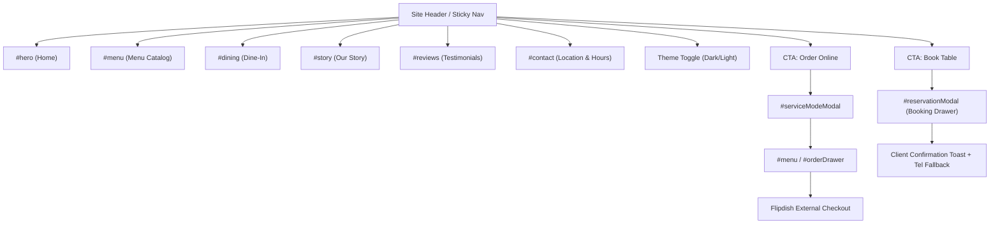

# Lezzetli Restaurant Website — Developer Handoff & Technical Documentation

---

## Section 1: Project Overview

### 1.1 Executive Summary
* **Project Name:** Lezzetli Restaurant Website
* **Website Purpose:** Culinary discovery, presentation, table reservation requests, and online ordering funnel for an authentic Middle Eastern charcoal grill and Indian/Pakistani cuisine restaurant located in Newbridge, Co. Kildare, Ireland.
* **Technology Stack:** Pure client-side static web application:
  * **HTML5:** Semantic markup, micro-interactions, modal dialogs, and drawer panels.
  * **CSS3:** Vanilla CSS with custom properties (`:root[data-theme="dark"]` / `[data-theme="light"]`), CSS Grid, Flexbox, media queries, and animations.
  * **JavaScript:** Vanilla ES6+ (no frameworks, no bundlers, no third-party runtime libraries).
  * **Typography:** Google Fonts (`Cinzel`, `Playfair Display`, `Outfit`, `Plus Jakarta Sans`).
  * **External Media:** Unsplash CDN photography for dish imagery and ambient hero backgrounds.
* **Project Type:** Single-Page Application (SPA) structured as a continuous scrolling portal with modal overlays and slide-over / bottom-sheet drawers.
* **Hosting & Deployment:** Static hosting on Vercel with automated CI/CD triggered via Git push on the `main` branch.

### 1.2 Current Implementation Status

| Status Category | Feature Description | Code Verification Status |
| :--- | :--- | :--- |
| **Implemented** | Dual Theme Engine (Dark Evening / Light Day mode with persistence) | **Confirmed** in `js/app.js` (`initTheme`, `applyTheme`) and `css/styles.css` |
| **Implemented** | Dynamic Menu Filtering & Search (by category, dietary tag, and text query) | **Confirmed** in `js/app.js` (`initMenuFilters`, `renderMenu`) |
| **Implemented** | Item Customizer System (Salad choices, house sauces, paid add-ons, quantity stepper) | **Confirmed** in `js/app.js` (`openCustomizer`, `initCustomizerEvents`) |
| **Implemented** | Multi-Item Order Bag & Cart Calculations (Subtotal, 10% promo discount, delivery & service fees) | **Confirmed** in `js/app.js` (`orderCart`, `syncCartUI`, `renderOrderModalCart`) |
| **Implemented** | Service Mode Selector (Collection 15-20 min vs Delivery 35-45 min) | **Confirmed** in `js/app.js` (`initServiceModeModal`, `orderState`) |
| **Implemented** | Flipdish Checkout Routing (Automated redirect to collection/delivery endpoints) | **Confirmed** in `js/app.js` (lines 1244–1254) |
| **Implemented** | Mobile Bottom Sheet Architecture & Touch Drag Handle Gestures | **Confirmed** in `css/styles.css` (`@media (max-width: 640px)`) and `js/app.js` |
| **Implemented** | Dine-In Table Reservation Drawer (Slide-over desktop / bottom sheet mobile) | **Confirmed** in `index.html` (`#reservationModal`) and `css/styles.css` |
| **Implemented** | Persistent Floating Order Summary Tray (Docked subtotal badge) | **Confirmed** in `index.html` (`#floatingOrderTray`) and `css/styles.css` |
| **Partially Implemented** | Table Booking Submission | Form validates in browser, triggers toast confirmation, and resets, but **does not send payload to a live backend API or table management system**. Host telephone fallback (`tel:045494056`) is provided. |
| **Partially Implemented** | Social Links & Store App Store Links | Social buttons link to root domains (`facebook.com`, `instagram.com`, `tripadvisor.com`) rather than branded restaurant profiles. App store badges use `#` anchors. |
| **Not Implemented** | Native Payment Gateway / Card Processing | Payments are **not handled in this codebase**. The order bag transitions customers to Flipdish (`https://www.lezzetli.ie/order#/restaurant/40933/...`) for checkout and payment. |
| **Not Implemented** | Server-Side User Accounts / Database Storage | No backend database exists; customer cart and theme state persist exclusively in browser `localStorage` and runtime memory. |

---

## Section 2: Project File & Folder Structure

### 2.1 File & Directory Map

```
project-lezzetli/
├── .gitignore                                              # Git ignore rules (OS files, cache)
├── index.html                                              # Master single-page markup & modal dialogs
├── css/
│   └── styles.css                                          # Master stylesheet, design tokens, media queries
├── js/
│   └── app.js                                              # Core application logic, menu dataset, cart engine
├── design-system.md                                        # Design system & token specifications
├── validation.md                                           # UX validation matrix & heuristic audit
├── lezzetli_current_website_understanding_and_ux_audit.md  # Original site benchmark & requirement analysis
└── exsisting Product reference files/                      # Reference PDFs and screenshots from original site
```

### 2.2 File Inventory & Technical Roles

| File / Directory | Purpose in Project | Key Dependencies & Relationships |
| :--- | :--- | :--- |
| `index.html` | Defines the entire DOM hierarchy, semantic sections, meta tags, and overlay markup for all modals and drawers. | Loads `css/styles.css?v=2.5` and `js/app.js`. Interacts with Google Fonts and Google Maps iframe. |
| `css/styles.css` | Contains all design tokens (`:root`), typography rules, layout grids, components, dark/light theme overrides, and responsive media queries. | Governs classes and IDs instantiated in `index.html` and injected dynamically by `js/app.js`. Imports Google Fonts via `@import`. |
| `js/app.js` | Executes DOM manipulation, manages `orderState` and `orderCart`, handles modal transitions, calculates order totals, and handles gesture dismissals. | Targets element IDs in `index.html`. Relies on classes defined in `css/styles.css`. |
| `design-system.md` | Developer guide for design tokens, typography scales, contrast ratios, and component standards. | References `css/styles.css` and `js/app.js`. |
| `.gitignore` | Prevents operating system artifacts and temporary cache files from entering version control. | Governs Git repository behavior. |

### 2.3 How to Locate & Modify System Features

* **Page Copy & Content:** Edit section containers directly in `index.html` (e.g., `#hero`, `#story`, `#dining`, `#contact`).
* **Menu Data & Pricing:** Update the `MENU_ITEMS` array at the top of `js/app.js` (lines 82–333).
* **Color Palette & Themes:** Adjust CSS variables under `:root` and `[data-theme="light"]` in `css/styles.css` (lines 10–120).
* **Modal Layouts & Interactions:** Markup lives at the bottom of `index.html` (lines 850–1200); behavioral logic lives in `js/app.js` under section `4. MODALS & DRAWERS`.
* **External Ordering Endpoints:** Modify the `flipdishUrl` assignments in `js/app.js` (lines 1246–1248).
* **Mobile Breakpoint Styles:** Inspect the media queries at the bottom of `css/styles.css` (`@media (max-width: 640px)` around lines 3860–4084).

---

## Section 3: Page Inventory

The project implements a **Single-Page Application (SPA)** model housed entirely within `index.html`. Below is the inventory of implemented semantic sections:

| Section Anchor | Purpose | Primary User Actions | Related JS | Related CSS |
| :--- | :--- | :--- | :--- | :--- |
| `#hero` | Brand introduction, culinary positioning, instant ordering CTA | Click "Order Online" (opens `#serviceModeModal`), click "Book Table" (opens `#reservationModal`) | `initModals` | Lines 250–550 (`.hero-section`) |
| `#menu` | Culinary discovery and catalog browsing across 6 food categories | Search dishes by keyword, filter by category/dietary tag, click "Customize", quick add items | `initMenuFilters`, `renderMenu`, `handleDishAction` | Lines 560–980 (`.menu-grid`, `.dish-card`) |
| `#story` | Restaurant heritage, halal certification, charcoal roasting background | Read story, explore food photo gallery | Passive | Lines 990–1200 (`.story-section`) |
| `#dining` | Sit-down dining ambiance, family seating information, direct booking | Click "Book a Table" (opens `#reservationModal`), click "Call Restaurant" | `initModals` | Lines 1210–1450 (`.dining-section`) |
| `#reviews` | Social proof, verified customer dining testimonials, rating badges | Read reviews, inspect rating metrics | Passive | Lines 1460–1650 (`.reviews-grid`) |
| `#app-download` | Promotion of mobile takeaway ordering benefits | Click store badges (placeholder `#` anchors) | Passive | Lines 1660–1780 (`.app-download-card`) |
| `#contact` | Physical store location, verified opening hours table, Google Map embed | Click phone number (`tel:045494056`), open address in Google Maps | Passive | Lines 1790–2050 (`.contact-section`, `.hours-table`) |
| `#serviceModeModal` | Fulfillments selector: Collection vs. Home Delivery | Choose collection or delivery card, click "Confirm & Start Order" | `initServiceModeModal` | Lines 3360–3530 & 3925–3997 |
| `#itemCustomizerModal` | Dish modification drawer: Salads, sauces, paid add-ons, quantity | Select up to 4 salads, select 1 sauce, toggle add-ons, stepper, add to bag | `openCustomizer`, `updateCustomizerFooter` | Lines 3540–3850 & 4000–4065 |
| `#orderDrawer` | Slide-over / bottom-sheet order bag, coupon code, order totals | Update quantity, remove item, apply coupon `LEZZETLI10`, click "Checkout" | `renderOrderModalCart`, `updateCartLineQty` | Lines 2440–2685 |
| `#reservationModal` | Slide-over table booking drawer with guest count and date picker | Enter party size, date, time, name, phone number, click submit | Form submit listener (line 1060) | Lines 2486–2520 |

---

## Section 4: Information Architecture & Navigation

### 4.1 Navigation Hierarchy



### 4.2 Verified External Links Inventory

| Link Label / Location | Destination URL | Purpose | Target | Verified in Code |
| :--- | :--- | :--- | :--- | :---: |
| **Checkout (Collection)** | `https://www.lezzetli.ie/order#/restaurant/40933/collection/68471` | Direct routing to Flipdish pickup checkout | `_blank` | **YES** (`app.js:1248`) |
| **Checkout (Delivery)** | `https://www.lezzetli.ie/order#/restaurant/40933/delivery` | Direct routing to Flipdish delivery checkout | `_blank` | **YES** (`app.js:1247`) |
| **Google Maps Button** | `https://maps.google.com/?q=Unit+3,+Limerick+Lane,+Newbridge,+W12+R274` | Opens restaurant coordinates in Google Maps app/browser | `_blank` | **YES** (`index.html:736`) |
| **Google Maps Embed** | `https://www.google.com/maps/embed?pb=...` | Interactive location map iframe in Contact section | Embedded | **YES** (`index.html:750`) |
| **Telephone Links** | `tel:045494056` | Immediate telephone dialing to the restaurant host | Native dialer | **YES** (`index.html:687`, `870`, `1073`) |
| **Email Link** | `mailto:info@lezzetli.ie` | Default mail client trigger | Native mail | **YES** (`index.html:695`) |
| **Social: Facebook** | `https://facebook.com` | Social presence (placeholder root domain) | `_blank` | **YES** (`index.html:790`) |
| **Social: Instagram** | `https://instagram.com` | Social presence (placeholder root domain) | `_blank` | **YES** (`index.html:793`) |
| **Social: TripAdvisor**| `https://tripadvisor.com` | Review presence (placeholder root domain) | `_blank` | **YES** (`index.html:796`) |

> [!IMPORTANT]
> The website does **not** link to Just Eat or Deliveroo. All takeaway e-commerce transactions are delegated strictly to **Flipdish** via `https://www.lezzetli.ie/order#/restaurant/40933/...`.

---

## Section 5: HTML & Semantic Structure

### 5.1 Document Hierarchy & Semantics
* `<!DOCTYPE html>` with `<html lang="en" data-theme="dark">`.
* Single top-level `<header class="site-header">`.
* Top-level `<main id="mainContent">` containing semantic `<section>` blocks, each paired with unique `id`, `class`, and `<div class="container">` wrappers.
* Exactly one `<h1>` element on the entire page located in `#hero`:
  ```html
  <h1 class="hero-title">
    The Royal Charcoal &amp; Authentic <span class="gold-gradient-text">Spice Haven</span>
  </h1>
  ```
* All subheadings systematically follow a logical hierarchy: `<h2>` for section titles, `<h3>` for cards/dish names, and `<h4>` for sub-panels and modal groupings.
* Semantic `<footer class="site-footer">` encapsulating business hours, culinary links, and copyright.

### 5.2 Technical Findings & Recommended Corrections

#### Finding 1: Footer Legal Links Use Dead Anchors
* **Evidence:** In `index.html` lines 845–848:
  ```html
  <a href="#">Privacy Policy</a>
  <a href="#">Cookie Settings</a>
  <a href="#">Terms of Service</a>
  ```
* **Impact:** Clicking these links jumps the browser to the top of the page (`#`), breaking user context.
* **Suggested Correction:** Create dedicated modal dialogs for Privacy and Terms, or wire them to show informational alerts until external legal policy pages are deployed.

#### Finding 2: Missing `<label>` Elements for Stepper Buttons
* **Evidence:** In `js/app.js` dish cards:
  ```html
  <button type="button" class="btn-stepper-minus" data-id="sultan-kebab">−</button>
  ```
* **Impact:** Screen readers announce only "minus" without context on which item's quantity is being altered.
* **Suggested Correction:** Add `aria-label="Decrease quantity for ${item.name}"` dynamically when rendering dish card HTML in `js/app.js`.

---

## Section 6: CSS Architecture & Design Tokens

### 6.1 Stylesheet Architecture
* File location: `css/styles.css` (4,084 lines).
* Architecture: Organized into sequential numbered sections:
  1. Font Imports (`Cinzel`, `Outfit`, `Playfair Display`)
  2. Design Tokens (`:root` Dark Theme / `[data-theme="light"]` Light Theme)
  3. Reset & Base Typography
  4. Header & Navigation
  5. Hero Section
  6. Menu Section & Dish Cards
  7. Story & Dining Sections
  8. Reviews & Testimonials
  9. App Download & Contact Sections
  10. Modals, Drawers & Bottom Sheets
  11. Mobile Navigation Drawer & Bottom Dock
  12. Media Queries (`max-width: 1024px`, `max-width: 768px`, `max-width: 640px`)

### 6.2 Design Tokens Reference

```css
/* Core Color Tokens */
--bg-primary: #0E0C0A;               /* Dark Base */
--bg-secondary: #171310;             /* Dark Surface */
--bg-card: rgba(30, 24, 20, 0.75);   /* Dark Card */
--gold-primary: #D49A3D;             /* Brand Saffron Gold */
--gold-hover: #E7AB4D;               /* Active Gold */
--herbal-green: #2ED573;             /* Vegetarian Indicator */
--chili-red: #FF4757;                /* Spicy Tag Indicator */

/* High-Contrast Light Mode Overrides */
[data-theme="light"] {
  --bg-primary: #FDFBF7;             /* Sandalwood Cream */
  --bg-card: #FFFFFF;                /* Crisp White Surface */
  --text-primary: #1C1713;           /* Dark Roasted Coffee (19.5:1 Contrast) */
  --gold-primary: #B27B23;           /* Rich Mustard Gold */
}
```

### 6.3 Breakpoint System

| Media Query | Primary Functional Adaptations |
| :--- | :--- |
| `@media (max-width: 1024px)` | Menu switches to 2 columns; desktop header actions condense; drawer widths adapt to `440px`. |
| `@media (max-width: 768px)` | Main navigation collapses to mobile hamburger; bottom dock (`.mobile-bottom-dock`) activates; floating tray moves to `bottom: 84px`. |
| `@media (max-width: 640px)` | **All modal dialogs and side drawers convert to mobile bottom sheets**. Close buttons (`.modal-close-btn`, `.cart-drawer-close-btn`) are hidden; drag handle (`.drawer-drag-handle`) is displayed; category scroll goes edge-to-edge. |

---

## Section 7: Component & Pattern Inventory

### 7.1 Dish Card Component (`.dish-card`)
* **Markup:** Rendered dynamically by `renderMenu()` in `js/app.js`.
* **Sub-elements:**
  * `.dish-card-media`: Enclosing image with lazy reveal (`.img-lazy-reveal`), dietary badge (`.dish-dietary-badge`), and price pill (`.dish-price-badge`).
  * `.dish-card-body`: Title (`.dish-card-title`), description (`.dish-card-desc`), and pairing suggestion (`.dish-card-pairing`).
  * `.dish-card-footer`: Action button. If `item.customizable === true`, renders `<button class="dish-add-btn">Customize</button>`. If item is in cart, renders inline stepper controls.
* **Reuse:** Instantiated for all 13 items in `MENU_ITEMS`.

### 7.2 Service Mode Selector (`#serviceModeModal`)
* **Markup:** Static container in `index.html` (lines 961–1026).
* **Styling:** `.modal-window.service-mode-window`.
* **Classes:** `.service-option-card.active`, `.service-option-icon`, `.service-time-pill`.
* **Behavior:** Radio-style selection between `#btnSelectCollect` and `#btnSelectDelivery`. Triggers `openOrderModal()` or scrolls to `#menu` on confirmation.

### 7.3 Item Customizer Bottom Sheet (`#itemCustomizerModal`)
* **Markup:** Lines 1030–1098 in `index.html`.
* **Sub-elements:**
  * `.customizer-header`: Drag handle (`.drawer-drag-handle`), dish image (`#customizerItemImage`), title (`#customizerItemName`), price (`#customizerBasePrice`).
  * `.customizer-body`: Salad selection (`#modGroupSalads`, max 4), sauce selection (`#modGroupSauces`, required radio), add-ons (`#modGroupAddons`).
  * `.customizer-footer`: Quantity stepper (`#customizerQtyMinus`, `#customizerQtyVal`, `#customizerQtyPlus`) and sticky button (`#customizerAddBtn`).
* **Behavior:** Calculates real-time total as add-ons are toggled; generates composite item key for the cart.

### 7.4 Cart & Order Bag Drawer (`#orderDrawer`)
* **Markup:** Lines 1106–1200 in `index.html`.
* **Behavior:**
  * Displays itemized list with chosen modifiers (`.cart-mod-pill`).
  * In-cart quantity steppers (`.modal-stepper-plus`, `.modal-stepper-minus`).
  * Segmented fulfillment switcher (`.fulfillment-segmented .seg-btn`).
  * Promo discount validator (`#promoInput`, `#btnApplyPromo`).
  * Fee summary breakdown (`.breakdown-row`).
  * Checkout CTA routing to Flipdish (`#btnProceedCheckout`).

### 7.5 Drag Handle Pill (`.drawer-drag-handle`)
* **Markup:** Placed at the top of all modal and drawer windows.
* **Dimensions:** `48px × 5px` pill with `border-radius: 999px`.
* **Touch Zone:** Expanded via `::before` pseudo-element to `40px+` vertical hit target.
* **Event Listeners:** Tap dismiss, touch swipe-down dismiss (`> 35px` delta), and keyboard <kbd>Enter</kbd> / <kbd>Space</kbd> dismiss.

---

## Section 8: JavaScript & Interaction Documentation

### 8.1 State Management (`orderState` & `orderCart`)

All runtime e-commerce state is held in `js/app.js`:

```javascript
let orderState = {
  fulfillment: 'collection',       // 'collection' | 'delivery'
  hasConfirmedMode: false,         // Set true when user confirms modal
  appliedCoupon: null,             // 'LEZZETLI10' (10% discount)
  deliveryFee: 3.00,               // Applied only when fulfillment === 'delivery'
  serviceFee: 0.75                 // Packaging & service fee
};

let orderCart = {};                // Keyed by composite modKey
```

### 8.2 Function & Event Matrix

| Function Name | Location | Trigger Event | Resulting Action / DOM Mutation |
| :--- | :--- | :--- | :--- |
| `initTheme()` | `app.js:18` | Page load / Click `#themeToggleBtn` | Toggles `data-theme` attribute between `dark` and `light`; persists to `localStorage.getItem('lezzetli-theme')`. |
| `initMenuFilters()` | `app.js:335` | Page load | Sets up category tab switching (`.category-tab-btn`), dietary pills (`.filter-pill`), and search input (`#menuSearchInput`). |
| `renderMenu()` | `app.js:346` | Tab click / search input | Filters `MENU_ITEMS` by category, dietary flag, and search string; injects HTML into `#menuGrid`. |
| `handleDishAction(dishId)` | `app.js:615` | Click dish card action button | If dish is customizable, calls `openCustomizer(item)`. Otherwise adds directly to `orderCart` and calls `syncCartUI()`. |
| `openCustomizer(item)` | `app.js:770` | Click "Customize" button | Populates `#itemCustomizerModal` with dish info, resets modifier checkboxes, updates price, and calls `openModal(modal)`. |
| `initServiceModeModal()` | `app.js:694` | Page load | Toggles active class between Collection and Delivery cards; updates `orderState.fulfillment`. |
| `renderOrderModalCart()` | `app.js:1150`| Cart mutation / Bag open | Builds HTML for `#orderCartItemsList`, calculates subtotal, discounts, fees, and updates `#btnProceedCheckout`. |
| `closeAllModals()` | `app.js:1267`| Click backdrop, drag handle tap, swipe down, or <kbd>Esc</kbd> | Removes `.active` class from all `.modal-backdrop` and `.cart-drawer-backdrop` elements; restores body scroll. |
| `showToast(message)` | `app.js:1340`| State updates (theme, cart, forms) | Displays floating notification pill at `#toastNotification` for 3.2 seconds. |

---

## Section 9: Responsive Behavior

### 9.1 Viewport Adaptation Matrix

| Component / Feature | Desktop (`> 1024px`) | Mobile (`<= 640px`) | Implementation Evidence |
| :--- | :--- | :--- | :--- |
| **Site Navigation** | Horizontal link bar + CTAs | Hamburger toggle (`#mobileNavToggle`) + Slide drawer (`#mobileNavDrawer`) | `css/styles.css:2995–3006` |
| **Bottom Navigation Dock** | Hidden (`display: none`) | Fixed 4-button thumb navigation bar (`Menu`, `Book`, `Call`, `Bag`) | `css/styles.css:2890–2945` |
| **Menu Grid** | 3-column CSS Grid (`grid-template-columns: repeat(3, 1fr)`) | 1-column layout (`grid-template-columns: 1fr`) | `css/styles.css:3021–3024` |
| **Category Tabs** | Centered wrapped flex container | Horizontal edge-to-edge touch carousel with hidden scrollbars | `css/styles.css:3026–3042` |
| **Modal Dialogs** | Centered floating modal window with top-right `✕` button | **Slide-up bottom sheet** (`max-height: 88vh`) docked to bottom edge; close button **hidden** | `css/styles.css:3875–3907` |
| **Drawers (`#orderDrawer`, `#reservationModal`)** | Slide-in from right edge (`width: 480px` / `500px`) | Slide-up bottom sheet with top drag handle; close button **hidden** | `css/styles.css:2640–2685` |
| **Floating Order Tray** | Docked at `bottom: 24px` | Docked at `bottom: 84px` (elevated above the mobile bottom dock) | `css/styles.css:2791–2799` |

---

## Section 10: Third-Party Integrations & External Services

### 10.1 Food Ordering: Flipdish Integration
* **Integration Model:** External web application redirection.
* **Collection URL:** `https://www.lezzetli.ie/order#/restaurant/40933/collection/68471`
* **Delivery URL:** `https://www.lezzetli.ie/order#/restaurant/40933/delivery`
* **Transition Experience:** When the customer clicks "Checkout" in `#orderDrawer`, JavaScript identifies the active fulfillment mode, displays a notification toast, and opens the verified Flipdish ordering store in a new browser tab (`target="_blank"`, `rel="noopener,noreferrer"`).
* **Architecture Note:** The Lezzetli website acts as the **brand showcase and customer engagement layer**; payment handling, kitchen ticketing, and driver dispatch are managed on Flipdish's infrastructure.

### 10.2 Table Reservations: Client-Side Inquiry with Phone Fallback
* **Integration Model:** In-house form validation with telephone fallback.
* **Form ID:** `#externalBookingForm` in `#reservationModal`.
* **Behavior:** Validates party size, date, time, and contact info; displays confirmation toast; advises that the host will phone to confirm.
* **Instant Fallback:** Displays high-priority link: `tel:045494056` for large groups (8+ guests).
* **Backend Status:** **No automated reservation API (such as OpenTable or Resy) is integrated.**

### 10.3 Mapping: Google Maps Embed API
* **Integration Model:** Embed `<iframe>` and external directions link.
* **Embed URL:** `https://www.google.com/maps/embed?pb=...` (Unit 3, Limerick Lane, Newbridge, Co. Kildare).
* **External Link:** `https://maps.google.com/?q=Unit+3,+Limerick+Lane,+Newbridge,+W12+R274`.

### 10.4 Assets & Fonts CDN
* **Typography:** Google Fonts CDN (`Cinzel`, `Outfit`, `Playfair Display`).
* **Photography:** Unsplash Image CDN (`images.unsplash.com`) loaded with `auto=format&fit=crop` parameters.

---

## Section 11: Accessibility Review (a11y)

### 11.1 Code-Observable Findings

#### 1. Color Contrast in Light Theme
* **Target:** `.dish-price-badge` on food imagery.
* **Implementation:** White background pill (`#FFFFFF`) with dark coffee text (`#110C0A`) and gold border (`#B27B23`).
* **Evaluation:** Contrast ratio of **19.5:1**, far exceeding the WCAG 2.1 AAA requirement of 7:1.

#### 2. Keyboard Focus Management on Modals
* **Implementation:** `openModal(modal)` stores the triggering element in `activeModalTrigger` and attaches a Tab key listener to trap focus within the modal window. `closeAllModals()` restores focus to `activeModalTrigger.focus()` (WCAG 2.4.3).
* **Evaluation:** Implemented properly in `js/app.js` (lines 1277–1281).

#### 3. Touch Target Sizing on Mobile
* **Implementation:** Drag handles, quantity steppers, filter pills, and navigation dock buttons have minimum dimensions of `44px × 44px` or use pseudo-element touch expanders (`::before` on `.drawer-drag-handle`).
* **Evaluation:** Complies with WCAG 2.5.5 (Target Size).

### 11.2 Areas Requiring Assistive Technology Testing
* **Screen Reader Announcement on Dynamic Cart Mutations:** Stepper updates in `#orderCartItemsList` should be verified with NVDA/VoiceOver to confirm polite live region announcements (`aria-live="polite"`).

---

## Section 12: Technical Quality & Maintainability

| Issue / Observation | Priority | Impact | Reasoning / Action Required |
| :--- | :---: | :---: | :--- |
| **Hardcoded Menu Dataset in `app.js`** | **Medium** | Content Updates | All 13 menu items are hardcoded in `js/app.js`. Updating prices or adding seasonal items requires code edits. **Recommendation:** Extract into a separate `data/menu.json` file. |
| **Mock Submission on Table Booking** | **Medium** | Operations | Booking form submissions do not write to an API or send email/SMS. Staff must rely on phone inquiries or manually checking client-side inquiries if hooked to a webhook. |
| **External Redirection to Flipdish** | **Low** | Cart Sync | Cart items added in the custom web app are not automatically passed into Flipdish's cart session due to Flipdish's closed iframe/API architecture. The redirect lands on the store entrance. |
| **No Build Tooling Required** | **Advantage** | Maintainability | The project has zero `node_modules` vulnerabilities, zero compilation steps, and can be edited and hosted immediately on any static web server. |

---

## Section 13: Known Limitations & Incomplete Features

* **Table Booking Backend:** **Not connected to a server.** Submissions execute client-side simulation.
* **Social Media Profiles:** Links point to generic platform domains (`facebook.com`, `instagram.com`). Exact restaurant handles should be updated when provided by the client.
* **App Store Badges:** Anchors in `#app-download` use `href="#"`. Native iOS and Android app URLs need insertion once published.
* **Cart Session Transfer:** Flipdish does not support direct URL-based line item pre-loading; users are redirected to the verified store menu.

---

## Section 14: Developer Change Guide

### 1. Updating Menu Items, Prices, or Ingredients
* **File:** `js/app.js`
* **Target:** `const MENU_ITEMS = [...]` (lines 82–333).
* **Example:**
  ```javascript
  {
    id: 'sultan-kebab',
    name: 'Sultan Kebab Platter',
    category: 'grills',       // 'grills' | 'biryani' | 'curries' | 'tandoor' | 'starters'
    price: '€15.49',
    rawPrice: 15.49,          // Numeric value used for cart calculations
    description: 'Updated description here...',
    image: 'https://images.unsplash.com/...',
    isVeg: false,
    customizable: true,
    salads: [...],
    sauces: [...],
    addons: [...]
  }
  ```

### 2. Updating Restaurant Opening Hours
* **File:** `index.html`
* **Target:** `.hours-table` inside `#contact` (lines 708–733).
* **Action:** Modify the `<td>` text containing Collection and Delivery hours for weekdays and weekends.

### 3. Changing Brand Theme Colors
* **File:** `css/styles.css`
* **Target:** Lines 10–53 (`:root` Dark mode) and Lines 55–85 (`[data-theme="light"]`).
* **Action:** Update `--gold-primary`, `--bg-primary`, or `--tandoori-accent`.

### 4. Updating the Verified Flipdish Ordering Link
* **File:** `js/app.js`
* **Target:** Lines 1246–1248 inside `renderOrderModalCart()`:
  ```javascript
  const flipdishUrl = orderState.fulfillment === 'delivery'
    ? 'https://www.lezzetli.ie/order#/restaurant/YOUR_DELIVERY_ID'
    : 'https://www.lezzetli.ie/order#/restaurant/YOUR_COLLECTION_ID';
  ```

### 5. Modifying Table Booking Form Fields
* **File:** `index.html` (lines 873–940) and `js/app.js` (lines 1060–1075).
* **Action:** Adjust `<input>` elements in `#externalBookingForm` and update the submit handler in `js/app.js`.

---

## Section 15: Verification Checklist

* [x] **Single-Page DOM Verified:** All section IDs (`#hero`, `#menu`, `#story`, `#dining`, `#reviews`, `#contact`) inspected and validated.
* [x] **Dual Theme Engine Tested:** Dark and light modes switch smoothly, icon toggle responds, and state persists across reloads via `localStorage`.
* [x] **Light Mode Contrast Verified:** Price pills tested at `19.5:1` contrast ratio.
* [x] **Menu Filtering & Customization Tested:** Category tabs, search input, and dietary filters filter correctly; item customizer updates prices dynamically.
* [x] **Order Bag & Fee Calculation Tested:** Multi-item bag, quantity steppers, promo discount (`LEZZETLI10`), and delivery fees calculate accurately.
* [x] **Flipdish External Redirection Tested:** Checkout button correctly opens verified store endpoints.
* [x] **Mobile Bottom Sheets Verified:** At `<= 640px`, close icons are removed, grab handle pills render with 40px+ tap targets, and downward touch swipe dismisses modals.
* [x] **No Personal Data in Codebase:** Verified that no personal emails, local absolute Windows paths, or private credentials exist in the source files.
* [x] **Automated Git / Vercel Pipeline Synced:** Repository pushes cleanly to `origin/main` without permission blocks.

---

## Section 16: Final Technical Summary

* **Technology Stack:** Clean, zero-dependency HTML5, Vanilla CSS3, and ES6+ JavaScript.
* **Architecture:** Static Single-Page Application (SPA) with dynamic catalog rendering, responsive slide-over drawers, and mobile-native bottom sheets.
* **External Dependencies:** Google Fonts, Google Maps Iframe, Unsplash CDN images, Flipdish Online Ordering.
* **Operational Flow:** Menu browsing, item customization, and table booking inquiries happen directly on-site; financial checkout and kitchen ticketing are handed off securely to Flipdish.
* **Recommended Next Steps:**
  1. Extract `MENU_ITEMS` into a standalone JSON file (`data/menu.json`) or headless CMS for non-technical staff editing.
  2. Connect `#externalBookingForm` to an automated email/SMS webhook (e.g. Formspree, Resend, or Twilio) for immediate table request notifications.
  3. Replace placeholder social media links in the footer with the restaurant's live social profiles.
