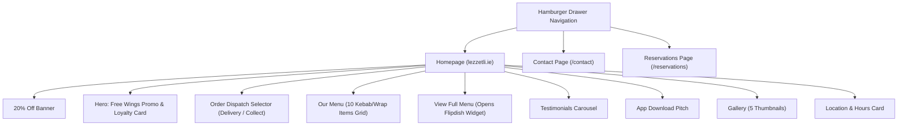
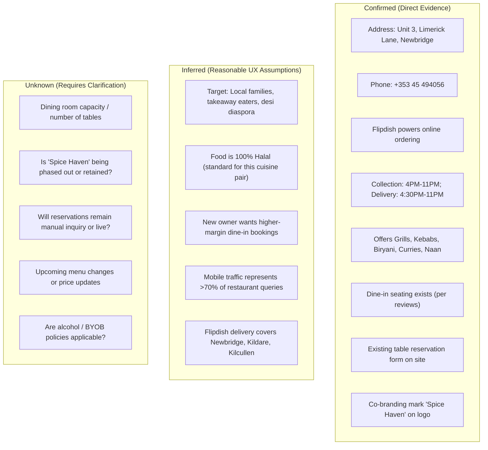

# Lezzetli Restaurant — Current Website Understanding & UX Audit

**Project:** Website Redesign for Lezzetli  
**Location:** Unit 3, Limerick Lane, Moorfield, Newbridge, Co. Kildare, Ireland (W12 R274)  
**Existing Website:** [https://lezzetli.ie](https://lezzetli.ie/)  
**Context:** The restaurant has been acquired by a new owner who wants to elevate the customer experience beyond a standard template, clarify the restaurant's offering, eliminate usability friction, and drive both dine-in and takeaway discovery.

---

## 1. What Lezzetli Is

Lezzetli is an established restaurant and takeaway located on Limerick Lane in Newbridge, County Kildare. It offers a distinctive culinary blend spanning **Middle Eastern charcoal grills & kebabs** alongside **authentic Pakistani & Indian cuisine** (biryanis, tandoori, curries, and freshly baked naans).

*   **Geographic Context:** Situated in Newbridge town centre (near Whitewater Shopping Centre and Moorfield), serving both local residents, workers, and surrounding towns including Kildare Town and Kilcullen.
*   **Brand Heritage & Legacy:** The existing website and signage display the brand mark **"Lezzetli"** with **"Spice Haven"** directly below the emblem, pointing to a dual brand name or previous operational identity (*"Lezzetli & Spice Haven"*).
*   **Operating Model:** The business operates as both a **sit-down dining establishment** (confirmed by customer reviews detailing dine-in dinner experiences, family dining, and table service) and a **high-volume takeaway and delivery service** (powered by Flipdish).

---

## 2. What the Existing Website Currently Provides

The current website is built upon a standard **Flipdish template ("Boxed Up Theme by Flipdish")**. It primarily functions as an online ordering portal rather than a complete restaurant brand experience.

### Core Capabilities Identified
1.  **Online Ordering (Delivery & Collection):** Embedded Flipdish ordering interface allowing customers to choose between pickup (10–20 min estimate) and delivery.
2.  **Customer Account & Loyalty Portal:** A "Log in" gateway enabling registered customers to review past orders, vouchers, and loyalty points.
3.  **Homepage Menu Preview:** A grid showing 10 sample items (almost exclusively kebabs and wraps) with price points and a link to view the full ordering menu.
4.  **Table Reservation Request Form (`/reservations`):** A custom booking inquiry form capturing name, phone, email, date, time, party size (default 2), and special requests (with a 40-day advance booking limit).
5.  **Direct Contact Form (`/contact`):** General inquiry webform alongside direct phone number and physical address.
6.  **Operating Hours & Location Display:** Clear breakdown of delivery hours vs. collection hours across weekdays and weekends, accompanied by an embedded Google Map.
7.  **Promotional Callouts:** Prominent discount banner (*"20% OFF ON FIRST ORDER"*) and hero offer (*"6 FREE PERI PERI WINGS WHEN YOU SPEND 30 EUROS"*).
8.  **Customer Reviews / Testimonials:** Carousel showing real customer feedback praising specific dishes (such as authentic Hyderabadi biryani and saag paneer).
9.  **Mobile App Links:** App Store and Google Play badges promoting a dedicated Lezzetli ordering app.
10. **Image Gallery:** Five static thumbnail images showing biryani, a sizzling grill platter, prawns, grilled chicken, and fried appetizers.

---

## 3. Primary Customer Tasks

Visitors landing on `lezzetli.ie` arrive with distinct intents:

| Task ID | Customer Mindset & Goal | Current Site Support |
| :--- | :--- | :--- |
| **Task A — Discover** | *"I've never heard of Lezzetli. What kind of food do they make, and what type of dining experience is it?"* | **Poor:** No introductory tagline or story. Looks like a generic takeaway kebab shop at first glance. |
| **Task B — Evaluate** | *"Does this restaurant cater to my preferences (e.g. halal, vegetarian, spicy, family-friendly, dine-in atmosphere)?"* | **Fragmented:** Clues exist only inside testimonial quotes; no official dietary or dining room information. |
| **Task C — Explore Menu** | *"What can I eat, what comes with each dish, and how much does it cost?"* | **Friction:** No "Menu" button in the main navigation; the homepage preview only lists 10 kebab items; users must enter the Flipdish order funnel. |
| **Task D — Decide** | *"Is the food high quality, fresh, and worth ordering or visiting for dinner?"* | **Moderate:** Customer testimonials are very positive, but food imagery is small and disjointed. |
| **Task E — Order Takeaway** | *"I want to order dinner for delivery or collection tonight."* | **Strong for regulars, Confusing for newcomers:** Prominent "Order for collection" button, but forces store selection/login before casual browsing. |
| **Task F — Book a Table** | *"I want to book a table for dinner with friends or family."* | **Supported with friction:** Exists in the slide-out menu, but uses a non-instant "Request booking" form requiring reCAPTCHA. |
| **Task G — Visit & Contact** | *"Where is the restaurant, what are their hours today, and can I call them?"* | **Good:** Address, phone (+353 45 494056), and delivery/collection hours are clearly stated on the homepage and contact page. |

---

## 4. Existing Information Architecture (IA)

### Critical IA Observations
*   **The Navigation Drawer Missing the #1 Item:** The slide-out hamburger menu contains only three links: **Home**, **Contact**, and **Reservations**. **There is NO "Menu" link in the main navigation menu.**
*   **Lack of Content Hierarchy:** Essential restaurant pages do not exist:
    *   No "About Us / Our Story" page explaining the heritage or dual Middle Eastern / Desi concept.
    *   No "Dine-In Menu" separate from the transactional Flipdish takeaway ordering funnel.
    *   No dedicated "Catering / Parties" or "Delivery Zones" information.
*   **Single-Page Flipdish Funnel Structure:** The entire homepage is configured as an e-commerce checkout funnel rather than a welcoming restaurant portal.

---

## 5. Detailed Homepage Analysis

### First Impression & Above-the-Fold
*   **Visual Dominance:** A stark dark grey/black background (`#1A1A1A`) with bright red accents. 
*   **Hero Section:** Dominated by a large takeaway coupon banner (*"6 FREE PERI PERI WINGS WHEN YOU SPEND 30 EUROS"*) and a customer loyalty login card (*"Log in to see your previous orders, vouchers & loyalty progress"*).
*   **Missed Proposition:** There is no brand headline (H1), no positioning statement, and no introductory summary explaining that Lezzetli is a Middle Eastern grill and Pakistani/Indian restaurant in Newbridge.
*   **Premature Transaction:** The first interactive widget encountered is the "Deliver / Collect" fulfillment selector before the customer has even seen what food is on offer.

### Content Flow Down the Page
1.  **"Our menu" Grid:** Displays 10 kebab/wrap cards (Sultan Kebab, Chicken Shawarma, Chicken & Lamb Gyro, Lamb Doner Large, Mix Kebab Large, etc.). 
    *   *Problem:* Gives visitors the false impression that Lezzetli is exclusively a fast-food kebab shop.
2.  **"What people are saying" (Testimonials):** Highly positive reviews mentioning *"authentic Hyderabadi biryani"*, *"best Saag Paneers in forever"*, and *"authentic desi vibes"*.
    *   *Disconnect:* The testimonials celebrate an Indian dining experience that is completely invisible in the menu section directly above it.
3.  **"A new way to experience food" (App Promotion):** A large section urging users to download iOS and Android apps, featuring a picture of a Biryani bowl.
4.  **"Gallery":** Five uncaptioned, non-clickable photos of varying lighting and quality.
5.  **"Locations":** Clear, informative card with phone, collection hours, delivery hours, and a Google Map.

---

## 6. Menu / Food Discovery Analysis

*   **Severe Category Imbalance:** The homepage preview showcases only fast-food grilled items:
    *   Sultan Kebab (€14.99)
    *   Chicken Shawarma (from €8.99 to €13.99)
    *   Chicken & Lamb Gyro (from €11.99)
    *   Lamb Doner (€8.99 to €13.99)
    *   Mix Kebab (€8.99 to €14.99)
*   **Invisibility of Major Food Categories:** Curries, Karahi, Biryani, Tandoori chicken, Fresh Naans, Samosas, and Vegetarian dishes are completely absent from the initial browsing surface.
*   **Trunctated Text:** Item descriptions are either missing or cut off with ellipses (e.g., *"Chicken Shawarma.."*).
*   **Lack of Dietary Indicators:** No clear markers for Halal, Vegetarian, Vegan, Gluten-Free, or Spice Level (Mild / Medium / Hot).
*   **Browse vs. Order Conflict:** A customer who simply wants to read the dine-in menu or understand prices is forced into an ordering widget flow.

---

## 7. Ordering / Reservation Analysis

### Ordering Flow (Takeaway & Delivery)
*   **Powered by Flipdish:** Proven e-commerce checkout engine with discount codes, loyalty tracking, and order scheduling.
*   **Strengths:** Fast for repeat customers who know what they want.
*   **Weaknesses:** Intrusive prompts to log in; treats the restaurant like a fast-food franchise rather than an artisanal kitchen.

### Reservation Flow (`/reservations`)
*   **Availability:** Accessible via the hamburger drawer.
*   **Form Structure:** Captures Name, Phone, Email, Date, Time, Party Size, and Special Requests.
*   **Friction Points:**
    *   It is an **asynchronous inquiry ("Request booking")**, not an instant table booking confirmation.
    *   No expectation is set regarding how or when the restaurant will confirm the booking (phone call vs. email).
    *   Requires a Google reCAPTCHA checkbox.
    *   Limits advance bookings to 40 days without explaining walk-in policies or large-party guidelines.

---

## 8. Restaurant Information & Trust Signals

| Element | Current Status | Audit Finding |
| :--- | :--- | :--- |
| **Physical Address** | Confirmed | Unit 3, Limerick Lane, Newbridge, W12 R274. Well displayed with map. |
| **Telephone** | Confirmed | +353 45 494056. Displayed clearly; needs mobile tap-to-call optimization. |
| **Opening Hours** | Confirmed | Detailed breakdown: Mon–Thu 4PM–11PM; Fri–Sat 4PM–11:59PM; Sun 4PM–11PM. |
| **Halal Status** | Inferred / Missing | Extremely relevant to both Middle Eastern and Desi cuisines, but not explicitly stated on the site. |
| **Parking & Directions** | Inferred from Review | Mentioned by a reviewer (*"Plenty of parking. Paid parking lot"*), but absent from the official website. |
| **Atmosphere / Interior** | Missing | No photographs of the dining room, table arrangements, or decor. |
| **Story / Chef / Heritage** | Missing | Zero information about the culinary team, spices, cooking techniques (charcoal tandoor), or origin story. |

---

## 9. Mobile Considerations

1.  **Navigation Discovery:** Mobile users opening the hamburger menu see only 3 links, with no way to access the food menu directly from the navigation bar.
2.  **Screen Real Estate Domination:** Aggressive promotional banners (wings discount, 20% coupon, app download pitch) take up several screens of scrolling before basic food information is reached.
3.  **Lack of Sticky Quick Actions:** No persistent mobile bar providing single-tap access to **"Call"**, **"View Menu"**, **"Reserve"**, or **"Order"**.
4.  **Form Ergonomics:** The reservation date/time inputs on mobile require multiple taps in standard browser pickers without inline guidance.

---

## 10. Summary of Current Strengths

1.  **Robust Functional Backbone:** Online ordering and delivery logistics are already operational via Flipdish.
2.  **Genuine Customer Acclaim:** Customer reviews highlight exceptional food quality (5/5 ratings for taste, biryani, and service).
3.  **Transparent Hours & Fulfillment:** Clear distinction between Delivery and Collection times.
4.  **Dual Revenue Channels:** The business already supports both table reservations and takeaway fulfillment.
5.  **Active Special Offers:** 20% first order discount provides a tangible incentive for conversion.

---

## 11. Current UX Problems (Problem → Evidence → User Impact)

### Problem 1: Cuisine Misrepresentation & The "Kebab Shop" Illusion
*   **Evidence:** The homepage preview grid features 10 kebab/gyro items. Biryani, curries, and tandoori are absent from the main display.
*   **User Impact:** Diners looking for an authentic Indian meal, biryani, or quality sit-down dinner conclude that Lezzetli is merely a late-night fast-food kebab shop and abandon the site.

### Problem 2: Menu Inaccessible from Primary Navigation
*   **Evidence:** The slide-out hamburger menu contains only: `Home`, `Contact`, `Reservations`.
*   **User Impact:** Browsing the menu is the primary goal of 80%+ of restaurant website visitors. Forcing them to hunt for an inline homepage button creates high friction and disorientation.

### Problem 3: Transaction-First Hero Overwhelms Hospitality & Dine-In
*   **Evidence:** Above the fold is packed with "6 Free Wings", "Log in for loyalty", and "Order for collection".
*   **User Impact:** Devalues the brand perception. Visitors seeking a pleasant evening out with family feel alienated by the aggressive takeaway-voucher styling.

### Problem 4: Brand Ambiguity & Missing Restaurant Story
*   **Evidence:** The logo emblem includes "Spice Haven" below "Lezzetli", yet nowhere is the name or culinary background explained.
*   **User Impact:** Generates confusion for first-time visitors and weakens trust in the restaurant's identity.

### Problem 5: Friction-Heavy Menu Scanning
*   **Evidence:** Clicking "View full menu" enters the Flipdish ordering catalog rather than an elegantly structured restaurant menu with categories, dietary badges, and descriptions.
*   **User Impact:** Users cannot easily compare items, verify halal/vegetarian choices, or check ingredients without stepping into an e-commerce cart.

### Problem 6: Ambiguous Reservation Expectations
*   **Evidence:** The `/reservations` page contains a basic form with a "Request booking" button and reCAPTCHA.
*   **User Impact:** Diners are left unsure whether their table is booked instantly, how long confirmation takes, or whether walk-ins are accepted.

---

## 12. Redesign Opportunities

1.  **Unified Dual-Concept Positioning:** Celebrate both traditions—the smoky artistry of Middle Eastern charcoal grills alongside the deep aromatics of Pakistani & Indian curries and biryanis.
2.  **Intuitive Navigation Architecture:** Clean top-level navigation:
    *   **Menu** (Categorized: Grills, Biryani & Rice, Curries & Karahi, Tandoori, Breads & Sides, Kids/Desserts)
    *   **Dine-In & Reservations** (Atmosphere, Table Bookings, Group Dining)
    *   **Order Online** (Clear CTA for Takeaway & Delivery)
    *   **About Our Story** (Heritage, Halal assurance, Fresh ingredients)
    *   **Contact & Visit** (Hours, Parking, Location, Phone)
3.  **Balanced Dual-Action Hero:** Present two clear paths immediately:
    *   *Primary CTA 1:* **"View Menu & Order Takeaway"**
    *   *Primary CTA 2:* **"Book a Table for Dining In"**
4.  **Interactive Food Discovery:** A scannable menu interface with tabs (Grills, Curries, Biryani, Vegetarian), spice indicators, halal tags, and clear pricing.
5.  **Hospitality & Trust Layer:** Dedicated section showcasing dining room ambiance, halal confirmation, chef's specialties, and curated customer testimonials.
6.  **Mobile-First Utility Bar:** A sticky bottom navigation bar on mobile for instant access to **Menu**, **Call**, **Reserve**, and **Order**.

---

## 13. Confirmed vs. Inferred vs. Unknown Context

---

## 14. Questions for the New Owner / Stakeholders

1.  **Brand Identity:** Is the restaurant officially called **Lezzetli** or **Lezzetli & Spice Haven**? Should "Spice Haven" be removed or featured as a tagline?
2.  **Business Priority:** What is the desired commercial balance between **Dine-in table reservations** vs. **Takeaway/Delivery orders**?
3.  **Halal & Dietary Assurance:** Is 100% of the meat certified Halal? Are there specific allergen or vegan accreditations to highlight?
4.  **Dining Room Experience:** What is the indoor seating capacity? Can we feature photography of the dining room, tableware, and interior atmosphere?
5.  **Reservation Management:** How are table reservations currently handled when submitted? Is the team satisfied with email/phone confirmation, or is an automated table management system (e.g., OpenTable, Resy, or Flipdish Table Booking) planned?
6.  **Ordering Engine:** Will Flipdish remain the primary online ordering system for takeaway and delivery?

---

## 15. Recommended Next Step

Now that the existing website has been thoroughly audited and the UX problems diagnosed, the recommended progression is:

*   **Next Deliverable (Phase 2): Deliverable 4 — Proposed Information Architecture (Sitemap & Navigation)** and **Deliverable 5 — Key User Flows** (Discover → Menu → Decision, Homepage → Order, Homepage → Reserve, Menu → Order).
*   Followed by **Deliverable 6 — Low-Fidelity Wireframes** for the key pages once the structure and flows are approved.
