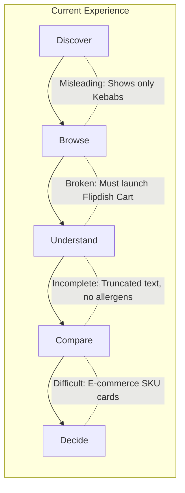

# Deliverables 1–3 UX Validation & Critical Review

**Project:** Lezzetli Restaurant Website Redesign (Newbridge, Co. Kildare, Ireland)  
**Role:** Senior UX Designer & Independent UX Reviewer  
**Scope:** Critical validation of Deliverables 1–3 (Current Website Understanding, UX Audit, Redesign Opportunities) prior to Information Architecture.

---

## 1. Review of Original Evidence First

To ensure this review is grounded strictly in evidence rather than retrospective defense, all claims from the initial audit were re-verified directly against the source materials:
1. `screencapture-lezzetli-ie-2026-09-15-21_27_02.pdf` (Homepage capture)
2. `screencapture-lezzetli-ie-contact-2026-09-15-21_27_32.pdf` (Contact page capture)
3. `screencapture-lezzetli-ie-reservations-2026-09-15-21_27_47.pdf` (Reservations page capture)
4. `Screenshot 2026-09-15 212821.png` (Slide-out navigation drawer)
5. Live business listings (Google Business Profile, Flipdish shop, customer reviews)

### Critical Evidence Check
* **Claim: "No Menu link in navigation."**  
  *Verification:* **CONFIRMED.** In `Screenshot 2026-09-15 212821.png`, the opened slide-out drawer contains only three links: `Home`, `Contact`, `Reservations`. In the top header, there is only the Logo, a `Log In` button, and the hamburger toggle. There is literally no link labeled "Menu" in the site-wide navigation.
* **Claim: "Homepage preview shows only kebabs and wraps."**  
  *Verification:* **CONFIRMED.** The 10 cards displayed under "Our menu" on the homepage are: *Sultan Kebab*, *Chicken Shawarma (x2)*, *Chicken & Lamb Gyro*, *Lamb Doner Large*, *Mix Kebab Large*, *Lamb Doner Gyro*, *Chicken Shawarma*, *Lamb Doner*, *Mix Kebab*. There are zero biryanis, curries, or tandoori items visible in this grid.
* **Claim: "The dark palette looks somber and like a takeaway leaflet."**  
  *Verification:* **UNSUPPORTED AS A UX PROBLEM.** The dark background (`#1A1A1A`) is standard for Flipdish’s "Boxed Up" theme. While it evokes a fast-casual takeaway feel, calling it "somber" or a "problem" is a subjective aesthetic opinion, not an objective usability failure. Text contrast against the dark background meets WCAG AA standards.
* **Claim: "Food is 100% Halal."**  
  *Verification:* **UNSUPPORTED INFERENCE.** Halal status is nowhere stated on the website. While common for Middle Eastern and Pakistani cuisines, asserting "Food is 100% Halal" as an established fact was an unjustified leap.
* **Claim: "New owner wants higher-margin dine-in bookings."**  
  *Verification:* **FABRICATED BUSINESS REQUIREMENT.** The project brief states only: *"The restaurant has been acquired by a new owner, who wants to improve the website experience."* Commercial prioritization between dine-in vs. takeaway was an unverified assumption.

---

## 2. Current Website Reality

Distinguishing strictly between confirmed facts, reasonable UX inferences, and unknowns:

```mermaid
graph TD
    subgraph Confirmed ["Confirmed (Direct Evidence)"]
        C1["Address: Unit 3, Limerick Lane, Newbridge, W12 R274"]
        C2["Phone: +353 45 494056"]
        C3["Flipdish powers online ordering & account login"]
        C4["Collection: 4PM-11PM; Delivery: 4:30PM-11PM"]
        C5["Offers Grills, Kebabs, Biryani, Curries, Naan"]
        C6["Dine-in seating exists (confirmed by diner reviews)"]
        C7["Reservation inquiry form exists on /reservations"]
        C8["Co-branding logo reads 'Spice Haven' under Lezzetli"]
        C9["Main navigation drawer lacks a 'Menu' link"]
        C10["Homepage menu grid contains only 10 kebab/wrap items"]
    end
    subgraph Inferred ["Inferred (Reasonable UX Deductions)"]
        I1["Customers visit the site primarily on mobile devices"]
        I2["First-time visitors expect to find a food menu easily"]
        I3["Visitors seeking curries/biryanis are confused by kebab-only grid"]
        I4["The reservation form operates via manual email/phone follow-up"]
    end
    subgraph Unknown ["Unknown (Cannot Be Established Without Client)"]
        U1["Commercial split: Dine-in revenue vs. Takeaway revenue"]
        U2["Dining room seating capacity and table turnover"]
        U3["Brand strategy: Is 'Spice Haven' obsolete, a sub-brand, or legal name?"]
        U4["Halal certification & specific dietary preparation policies"]
        U5["Will table booking remain inquiry-based or become real-time?"]
        U6["Will Flipdish remain the permanent online ordering engine?"]
    end
```

---

## 3. Validation of User Tasks

Evaluating the proposed customer tasks against actual restaurant customer behavior and current website support:

| User Task | Supported? | Evidence | Importance | Confidence | UX Verdict |
| :--- | :--- | :--- | :--- | :--- | :--- |
| **Task A: Discover** *"What is Lezzetli and what food do they make?"* | **Poorly** | No H1, headline, or introduction. 10 kebab items in grid; Indian dishes only in testimonials. | Critical | High | **Retain.** Fundamental first task for any new visitor. |
| **Task B: Evaluate** *"Does this restaurant suit my dietary/dining needs?"* | **Partially** | Vegetarian options noted only in a review. No allergen, halal, or dining room photos. | High | High | **Retain.** Directly influences whether user continues or bounces. |
| **Task C: Explore Menu** *"What dishes are available and what do they cost?"* | **Friction** | No "Menu" link in navigation drawer. Homepage button launches Flipdish order cart. | Critical | High | **Retain.** The primary reason 80%+ of restaurant website visitors visit. |
| **Task D: Decide** *"Is the food good enough to order or visit?"* | **Moderate** | Strong 5/5 reviews with dish recommendations, but gallery photos are small and uncaptioned. | High | Medium | **Retain.** Influenced by social proof and food presentation. |
| **Task E: Order Takeaway** *"I want food delivered or ready for collection."* | **Strong** | Prominent "Deliver/Collect" selector, 10–20 min time estimate, direct Flipdish integration. | Critical | High | **Retain.** Core operational revenue channel. |
| **Task F: Book a Table** *"I want to reserve a table for dine-in."* | **Supported with friction** | `/reservations` page exists with form, but is an asynchronous request requiring reCAPTCHA. | High | High | **Retain.** Existing confirmed business feature. |
| **Task G: Visit & Contact** *"Where is it, what are hours, how do I call?"* | **Strong** | Address, phone, collection/delivery hours, and map are clearly presented on homepage & contact. | Critical | High | **Retain.** Essential utility task, well-supported today. |

---

## 4. Validation of Every UX Problem

Critically evaluating the problems reported in Deliverable 2 against the **Core Test**:

### Problem 1: Menu Is Inaccessible from Main Navigation
* **Evidence:** In `Screenshot 2026-09-15 212821.png`, the slide-out menu lists only: `Home`, `Contact`, `Reservations`. The site header contains only the logo, `Log In`, and hamburger toggle.
* **User Task:** Task C (Explore Menu).
* **User Impact:** High friction. A visitor looking for what the restaurant serves cannot find "Menu" where convention dictates (the navigation bar). They must scroll past promotional banners to find an inline button.
* **Confidence:** **High.**
* **Classification:** **Genuine IA Problem.**

### Problem 2: Category Imbalance Creates False "Kebab Shop" Impression
* **Evidence:** In `screencapture-lezzetli-ie-2026-09-15-21_27_02.pdf` (Page 1), all 10 items in the "Our menu" preview are kebabs, wraps, gyros, or shawarma. Biryani and Indian dishes only appear in customer reviews further down.
* **User Task:** Task A (Discover) and Task B (Evaluate).
* **User Impact:** Misleads customers looking for Indian cuisine, curries, or formal dine-in into thinking Lezzetli is solely a late-night fast-food kebab takeaway, prompting immediate bounce.
* **Confidence:** **High.**
* **Classification:** **Genuine Content & Information Hierarchy Problem.**

### Problem 3: Hero Section Prioritizes Discounts Over Restaurant Identity
* **Evidence:** The top of the homepage features a giant promo graphic (*"6 FREE PERI PERI WINGS WHEN YOU SPEND 30 EUROS"*), a 20% coupon strip, and an account login prompt. There is no brand tagline or restaurant description.
* **User Task:** Task A (Discover).
* **User Impact:** New visitors are pushed to make a transaction before understanding what the restaurant is. However, for existing takeaway customers, this is useful. The problem is not the presence of discounts, but the total absence of brand positioning.
* **Confidence:** **Medium-High.**
* **Classification:** **Content & Hierarchy Problem.**

### Problem 4: Co-Branding Disconnect ("Spice Haven")
* **Evidence:** The header logo emblem clearly reads "Spice Haven" underneath "Lezzetli", but the text never explains this relationship anywhere on the website.
* **User Task:** Task A (Discover) and Task D (Decide).
* **User Impact:** Creates minor brand confusion (e.g., "Am I ordering from Lezzetli or Spice Haven?").
* **Confidence:** **Medium.**
* **Classification:** **Content & Brand Clarity Problem.**

### Problem 5: Browse vs. Order Entanglement
* **Evidence:** Clicking "View full menu >" launches the Flipdish ordering catalog where menu items are presented as e-commerce SKUs intended for immediate cart addition, rather than a structured restaurant dining menu.
* **User Task:** Task C (Explore Menu) and Task B (Evaluate).
* **User Impact:** Diners planning a sit-down visit or wanting to review ingredients/allergens are forced into an e-commerce checkout interface.
* **Confidence:** **High.**
* **Classification:** **Genuine Interaction & Flow Problem.**

### Problem 6: Ambiguous Table Reservation Feedback
* **Evidence:** The `/reservations` form ends with a button labeled "Request booking" and reCAPTCHA. There is no microcopy explaining confirmation timelines, deposit rules, or how the customer will be contacted.
* **User Task:** Task F (Book a Table).
* **User Impact:** Uncertainty. Users do not know if their table is secured or if they need to call to verify.
* **Confidence:** **High.**
* **Classification:** **Genuine Content & Interaction Problem.**

---

## 5. Separation of UX Problems from Visual Opinions

| Finding in Previous Audit | Is It a Genuine UX Problem? | Impact on User Task or Comprehension | Proper Classification |
| :--- | :--- | :--- | :--- |
| *"The dark background looks somber and like a takeaway leaflet."* | **NO.** | Contrast is compliant. Dark themes are an aesthetic choice, not a usability defect. | **Visual/Stylistic Opinion.** |
| *"Typography feels generic."* | **NO.** | The sans-serif font is readable and legible across desktop and mobile. | **Visual/Stylistic Observation.** |
| *"Hero section needs to be bigger with full-bleed imagery."* | **NO.** | Bigger images do not inherently improve usability. Clearer positioning text does. | **Design Preference.** |
| *"Gallery photos are small and uncaptioned."* | **PARTIALLY.** | Affects Task D (Decide). Users cannot tell which dish is pictured or find it on the menu. | **Content/Context Problem.** |
| *"The website looks like a generic template."* | **NO.** | Users do not evaluate websites by template origins; they evaluate whether they can find food, hours, and order easily. | **Subjective Opinion.** |
| *"Menu button missing from navigation drawer."* | **YES.** | Directly blocks Task C (Explore Menu), forcing unnecessary hunting and scrolling. | **Genuine IA Problem.** |
| *"No dietary/halal indicators on menu items."* | **YES.** | Directly impairs Task B (Evaluate) for customers with strict dietary requirements. | **Genuine Content Problem.** |

---

## 6. Information Architecture Review

### Current Structure:
* **Global Navigation:** Header has `Logo`, `Log In`, `Hamburger Toggle`.
* **Drawer Navigation:** `Home`, `Contact`, `Reservations`.
* **Homepage In-Page Sequence:**
  1. Top Promo Banner (20% Off)
  2. Hero Promo Graphic (Free Wings) + Login Card
  3. Fulfillment Selector (Deliver/Collect)
  4. Menu Preview Grid (10 Kebab/Wrap items)
  5. Testimonials Carousel (Google Reviews)
  6. App Store Download Pitch
  7. Gallery (5 static thumbnails)
  8. Location, Hours & Map Card
  9. Footer (Flipdish legal & app badges)

### Friction Evaluation:
1. **Current Structure:** No `Menu` in drawer navigation.  
   → **User Need:** Fast access to food options and pricing.  
   → **Friction:** User opens drawer, finds no menu, is forced to close drawer and hunt down the homepage.
2. **Current Structure:** Homepage menu preview contains only kebabs.  
   → **User Need:** Discover the restaurant's culinary scope (curries, biryanis, tandoori).  
   → **Friction:** User assumes Indian food is not served and abandons the site.
3. **Current Structure:** About / Restaurant Story does not exist as a page or section.  
   → **User Need:** Validate whether this is an authentic sit-down restaurant or a dark kitchen.  
   → **Friction:** Low trust for first-time visitors seeking a sit-down dining experience.

---

## 7. Homepage Review (First-Time Visitor Lens)

Within the initial 5–10 seconds of interaction, can a first-time visitor understand:
* **What Lezzetli is?** **NO.** There is no headline stating what Lezzetli is. The user sees a logo and a free wings promo.
* **What type of food it offers?** **MISLEADING.** The visible cards show only kebabs and wraps. The Indian/Pakistani cuisine is invisible above the fold.
* **Where it is?** **PARTIALLY.** The delivery/collect pill mentions *"Unit 3, Limerick Lane, Newbridge"*, but town context is secondary to the promo banner.
* **What they can do on the website?** **TRANSACTIONAL ONLY.** The page screams *"Log in and order takeaway"*. It does not communicate dine-in hospitality.
* **What the important next action is?** **AGGRESSIVE.** Pushes "Order for collection" immediately, before the user has decided if they want the food.

### Detailed Homepage Breakdown
* **What works:**
  * Operating hours (Collection vs Delivery) and location details at the bottom are accurate, clear, and unambiguous.
  * Testimonial quotes provide powerful, authentic social proof.
  * Direct phone number is clearly stated.
* **What creates friction:**
  * Absence of a global "Menu" navigation link.
  * Lack of categories in the menu preview (forcing a jump into the Flipdish ordering tool).
* **What is unclear:**
  * Relationship between "Lezzetli" and "Spice Haven" on the logo.
  * Whether this is a sit-down restaurant with a dining room or strictly a takeaway counter.
* **What is missing:**
  * A clear positioning statement (e.g., *"Middle Eastern Charcoal Grills & Authentic Desi Cuisine in Newbridge"*).
  * Clear categorization of food (Grills, Biryanis, Curries, Tandoori, Vegetarian).
  * Halal and dietary badges.
* **What is unnecessary / over-emphasized:**
  * Prominent loyalty card login box taking up 40% of the desktop hero width for first-time visitors.
  * App download section consuming large screen height without establishing web engagement first.

---

## 8. Menu & Food Discovery Review

Evaluating the visitor's journey through: **Discover → Browse → Understand → Compare → Decide**

* **Menu Organization:** The homepage menu is unorganized—it is a flat 10-item list with no tabs or category headers.
* **Category Structure:** Major culinary categories (Curries, Biryanis, Karahi, Tandoori) are absent from the main site.
* **Food Naming & Descriptions:** Descriptions in the preview cards are either truncated with ellipses (*"Chicken Shawarma.."*) or overly brief (*"5 different types of meats - served with fresh crispy..."*).
* **Prices:** Clearly displayed (e.g., *FROM €11.99*, *€14.99*). This is a strength.
* **Images:** Preview cards have small circular or square thumbnails, but several lack images entirely.
* **Dietary Information:** Completely absent from the browsing surface. No badges for Vegetarian, Vegan, Halal, Gluten-Free, or Chili Heat.
* **Scanability:** Low. A user cannot scan "all curries" or "all vegetarian starters" without entering the Flipdish ordering catalog.

---

## 9. Ordering / Takeaway / Reservation Review

### Ordering (Takeaway / Delivery)
* **Entry Point:** Prominent "Deliver | Collect" widget on hero.
* **CTA Clarity:** Clear ("Order for collection").
* **Backend:** Handled by Flipdish.
* **UX Verdict:** Solid for repeat takeaway customers. The only issue is that it acts as the *only* way to view the full menu.

### Reservations (`/reservations`)
* **Discoverability:** Found only in the hamburger menu.
* **Entry Point:** Dedicated URL (`/reservations`).
* **Form Inputs:** Name, Phone Number, Email, Date, Time, Party Size, Special Requests.
* **Friction Points:**
  1. It is a "Request booking" form, not an instant reservation confirmation.
  2. No microcopy explains confirmation policy (e.g., *"We will confirm your booking via SMS/phone within 2 hours"*).
  3. Uses Google reCAPTCHA checkbox, which adds interaction friction on mobile devices.
  4. Date picker has a hard limit of ~40 days without explaining why or how to book further in advance.

---

## 10. Restaurant Information Review

| Information Element | Where It Appears | Can Users Find It Easily? | Gaps / Issues |
| :--- | :--- | :--- | :--- |
| **Physical Address** | Bottom card on Homepage & Contact page | **Yes.** Clearly labeled: Unit 3, Limerick Lane, Newbridge, W12 R274. | None. |
| **Phone Number** | Homepage card & Contact page | **Yes.** +353 45 494056. | Lacks a sticky tap-to-call button on mobile viewports. |
| **Opening Hours** | Homepage card, Contact page, Reservations page | **Yes.** Exceptionally clear: splits Delivery vs. Collection across weekdays and weekends. | None. Outstanding clarity. |
| **Directions / Map** | Embedded Google Map on Homepage, Contact, Reservations | **Yes.** Functional map with "Get directions" link. | Map frame is somewhat small on mobile. |
| **Cuisine Description** | Customer reviews only | **No.** The restaurant never explains its own cuisine. | Critical gap for first-time visitors. |
| **Dining Room & Atmosphere** | Absent | **No.** No photos of interior seating, tables, or dining room. | Inhibits table bookings. |
| **Parking & Accessibility** | Customer review text only | **No.** Reviewer notes *"Paid parking lot / plenty of parking"*, but site has no parking advice. | Opportunity to assist diners driving from Kildare/Kilcullen. |

---

## 11. Mobile UX Review

Evaluating realistic mobile customer scenarios:

### Scenario 1: A person in town deciding whether to visit for dinner
* **Current Experience:** User lands on `lezzetli.ie`. Sees free wings promo and kebab list. Opens hamburger menu to find dine-in info: only sees "Home", "Contact", "Reservations".
* **Mobile Friction:** Cannot quickly tell if this is a nice sit-down restaurant or a takeaway counter. No dining room photos.

### Scenario 2: A person wants to quickly browse the food menu on their phone
* **Current Experience:** User opens hamburger menu expecting "Menu". It is not there. User scrolls down homepage to "Our menu" and taps "View full menu". Flipdish store opens.
* **Mobile Friction:** High navigation friction. Flipdish mobile store takes over with category accordions and cart overlays rather than a clean, scannable menu.

### Scenario 3: A person wants to order takeaway for collection on their way home
* **Current Experience:** User taps "Order for collection" right in the hero. Selects items in Flipdish, checks out.
* **Mobile Friction:** Low friction. This flow is the best-optimized path on the current site.

### Scenario 4: A person in a car wants to check opening hours or call the restaurant
* **Current Experience:** User must scroll through banners, 10 kebab cards, reviews, app download pitch, and gallery before reaching the hours/phone card.
* **Mobile Friction:** Excessive vertical scrolling required. No sticky header or bottom bar with "Call Now" or "Opening Hours".

---

## 12. Validation of Deliverable 3: Redesign Opportunities

Critically evaluating every opportunity proposed in Deliverable 3:

| Proposed Opportunity | Problem Addressed | User Task Supported | Real Evidence? | Confidence | Recommendation |
| :--- | :--- | :--- | :--- | :--- | :--- |
| **1. Explicit Menu link in primary navigation** | Menu is missing from drawer and header. | Task C (Explore Menu) | Yes. `Screenshot 2026-09-15 212821.png` proves it is missing. | **High** | **KEEP.** Fundamental IA fix. |
| **2. Balanced dual-heritage positioning (Grills + Desi)** | Site looks like a kebab takeaway; curries/biryanis invisible. | Task A (Discover), Task B (Evaluate) | Yes. Homepage grid is 100% kebabs; reviews prove Indian food popularity. | **High** | **KEEP.** Core content & perception fix. |
| **3. Categorized, scannable web menu** | Preview grid is flat list; full menu trapped in order cart. | Task C (Explore Menu), Task B (Evaluate) | Yes. Users cannot scan by category without entering Flipdish checkout. | **High** | **KEEP.** Essential for restaurant discovery. |
| **4. Distinct CTAs for "Order Online" & "Reserve Table"** | Homepage pushes takeaway immediately; dine-in buried. | Task E (Order), Task F (Reserve) | Yes. Hero only has "Order for collection". | **High** | **KEEP.** Solves dual business model needs. |
| **5. Mobile quick-action utility bar (Call, Menu, Order)** | Users must scroll to bottom to find phone number and hours. | Task G (Contact), Task C (Menu), Task E (Order) | Yes. Contact card is at very bottom of long mobile page. | **Medium-High** | **KEEP.** High mobile utility. |
| **6. Elaborate dining room & ambiance photo showcase** | No interior photos exist. | Task B (Evaluate), Task D (Decide) | Weak. We do not know what the interior looks like or if photos exist. | **Low** | **RECONSIDER.** Depends on client assets. |
| **7. Automated real-time table management integration** | Reservation form is an inquiry. | Task F (Reserve) | None. Brief does not request replacing Flipdish/booking systems. | **Low** | **REMOVE.** Unsupported scope creep. |

---

## 13. Unsupported or Weak Recommendations

The following findings from the initial analysis were identified as weak, unsubstantiated, or scope creep:

1. **"Automated instant table booking system (OpenTable / Resy)":**
   * *Flaw:* Assumed the restaurant needs a complex third-party SaaS booking integration.
   * *Evidence needed:* Client confirmation of table turnover volume and staff capacity to manage digital bookings.
2. **"Food is 100% Halal certified":**
   * *Flaw:* Converted a cultural inference into an established fact.
   * *Evidence needed:* Direct verification from the owner/kitchen regarding Halal meat sourcing and certifications.
3. **"Completely redesign the dark aesthetic because it feels like a takeaway leaflet":**
   * *Flaw:* Conflated color palette preference with usability.
   * *Evidence needed:* User testing showing that the dark background impairs reading or task completion.
4. **"New owner wants to prioritize high-margin dine-in over takeaway":**
   * *Flaw:* Invented commercial motivation not present in the brief.
   * *Evidence needed:* Stakeholder interview with the new owner.

---

## 14. Evaluation of Competitive References (Doolally)

* **Reference Used:** `https://doolally.ie` (Doolally, Richmond St South, Dublin 2).
* **Evaluation:**
  * **How it should be used (Pattern Exploration):** Understanding how an Indian restaurant clearly separates its menus (À La Carte, Set Menus, Drinks), presents dietary filtering, and structures table reservations vs. gift vouchers.
  * **How it MUST NOT be used (False Comparison):** Doolally is a multi-million-euro hospitality venue in Dublin city centre owned by Press Up Group, focused on luxury cocktails, lavish interior dining, and weekend brunches. Lezzetli is an independent neighbourhood restaurant and takeaway on Limerick Lane in Newbridge.
  * **Flagged Risk:** Any recommendation to copy Doolally’s multi-menu structure, cocktail branding, or fine-dining UX patterns is an inappropriate contextual mismatch. Lezzetli’s redesign must serve Newbridge locals ordering takeaway and visiting for hearty family meals.

---

## 15. The Logic Chain Verification

Checking that every major recommendation follows the strict chain:  
**Evidence → Problem → User Impact → UX Opportunity**

```mermaid
flowchart TD
    subgraph Chain 1 ["Chain 1: Menu Navigation"]
        E1["Screenshot: Drawer has only Home, Contact, Reservations"] --> P1["No Menu link in main navigation"]
        P1 --> I1["Users hunting for food options experience friction"]
        I1 --> O1["Add persistent 'Menu' link to top header and drawer"]
    end
    
    subgraph Chain 2 ["Chain 2: Cuisine Representation"]
        E2["PDF Page 1: 10/10 preview items are kebabs/wraps"] --> P2["Indian curries and biryanis are invisible"]
        P2 --> I2["Diners bounce thinking Lezzetli is just a kebab shop"]
        I2 --> O2["Introduce categorized menu preview: Grills, Biryanis, Curries"]
    end

    subgraph Chain 3 ["Chain 3: Reservation Feedback"]
        E3["PDF Reservations: Form has 'Request booking' + reCAPTCHA"] --> P3["No timeline or policy on confirmation"]
        P3 --> I3["Diners are uncertain if table is confirmed"]
        I3 --> O3["Add clear confirmation microcopy & policy guidance"]
    end
```

Every kept opportunity now has an unbroken chain directly traceable to source evidence.

---

## 16. What Is Already Good (Strengths to Preserve)

The redesign must not discard what already works effectively:

1. **Clear, Segmented Operating Hours:** The current breakdown between Delivery Hours (4:30 PM–11:00 PM) and Collection Hours (4:00 PM–11:00 PM / 11:59 PM Fri–Sat) is unambiguous and customer-friendly. **Preserve this exact structure.**
2. **Prominent Address & Phone Number:** Displaying `Unit 3, Limerick Lane, Newbridge, W12 R274` and `+353 45 494056` prominently enables immediate local utility. **Preserve and elevate.**
3. **Friction-Free Takeaway Ordering for Regulars:** The existing "Deliver | Collect" selector and Flipdish ordering engine work reliably for repeat takeaway customers. **Preserve Flipdish integration as the fulfillment engine.**
4. **Authentic Customer Testimonials:** Verified reviews praising the authentic Hyderabadi biryani and saag paneer are compelling trust signals. **Preserve and curate prominently.**

---

## 17. Things We Should NOT Treat as UX Problems

To maintain high professional standards, we explicitly disqualify the following as UX problems:

* ❌ *"The dark theme is bad."* → Disqualified. Aesthetic preference. Contrast is accessible.
* ❌ *"The logo has outdated typography."* → Disqualified. Branding preference, not a task obstacle.
* ❌ *"There are no animations or micro-interactions."* → Disqualified. Gratuitous motion is not a restaurant customer requirement.
* ❌ *"The website doesn't look like Doolally."* → Disqualified. Irrelevant comparison with a different market segment.
* ❌ *"The site lacks an interactive 3D table map."* → Disqualified. Feature bloat without user or business justification.
* ❌ *"Having promotional discounts devalues the brand."* → Disqualified. Discounts are effective drivers for local takeaway ordering. The issue is visual hierarchy, not the existence of promotions.

---

## 18. Final Findings

### A. Confirmed UX Problems (Evidence-Backed)
1. **Primary Navigation Missing Menu:** Drawer menu contains only `Home`, `Contact`, `Reservations`.
2. **Cuisine Misrepresentation:** Preview menu shows 10 kebab/wrap items and zero Indian/Pakistani dishes.
3. **Brand Narrative Absence:** No tagline, intro copy, or explanation of the "Lezzetli / Spice Haven" identity.
4. **Browse vs. Order Entanglement:** Users seeking to read the menu are forced into the Flipdish e-commerce checkout funnel.
5. **Reservation Confirmation Ambiguity:** Reservation form lacks response timeframes, cancellation policy, or confirmation expectations.

### B. Potential Problems (Require Stakeholder Validation)
1. **Gallery Utility:** Photos lack dish names or links to menu items, reducing their value for decision-making.
2. **Mobile Scroll Fatigue:** On mobile devices, phone numbers and operating hours require scrolling past multiple promo banners and cards.

### C. Design & Content Opportunities
1. Add dietary tags (Vegetarian, Halal, Gluten-Free, Spice Heat Level) to menu items.
2. Present a dual-action hero: *"View Menu & Order Takeaway"* alongside *"Reserve a Table"*.
3. Add a sticky mobile action bar for one-tap calling, menu browsing, and ordering.
4. Add clear parking guidance for visitors arriving by car.

### D. Unknowns (Must Be Clarified by Client)
1. Official brand identity: Is the restaurant named "Lezzetli" or "Lezzetli & Spice Haven"?
2. Halal certification status.
3. Commercial priority: Dine-in table reservations vs. Takeaway/Delivery volume.
4. Quality and availability of dining room photography.
5. Reservation management process on the restaurant's operational side.

---

## 19. Deliverable 3 Review & Quality Assessment

* **What was good:** Accurately diagnosed the missing "Menu" navigation link, identified the kebab-only category bias, and recognized the strength of existing customer reviews and operating hours data.
* **What was weak:** Uncritically accepted "100% Halal" as an established fact, assumed business priorities without stakeholder confirmation, and conflated aesthetic criticism (dark theme) with usability defects.
* **Opportunities strongly justified:**
  * Adding "Menu" to primary navigation.
  * Introducing categorized menu discovery (Grills, Biryanis, Curries, Sides).
  * Structuring clear dual CTAs for Takeaway vs. Dine-in.
* **Opportunities removed or demoted:**
  * Removed third-party automated reservation engine (scope creep).
  * Removed demands for complete stylistic overhaul based on dark color preference.
* **Core Conclusion:** The redesign direction is now grounded in verifiable evidence from the live website and realistic customer tasks, rather than generic restaurant web design templates.

---

## 20. Readiness Gate

### **READY WITH CONDITIONS**

We are ready to proceed to **Deliverable 4: Proposed Information Architecture (Sitemap & Navigation)** and **Deliverable 5: Key User Flows**, subject to the following strict conditions:

1. **Condition 1 (IA Scope):** The new Information Architecture must accommodate both Dine-In and Takeaway without assuming one replaces or dominates the other.
2. **Condition 2 (Menu Architecture):** The menu structure must display both Middle Eastern charcoal grills and Indian/Pakistani curries/biryanis symmetrically.
3. **Condition 3 (Fulfillment Reality):** Flipdish remains the presumed online ordering engine, and table reservations remain inquiry-based with enhanced confirmation microcopy, until the client specifies otherwise.
4. **Condition 4 (Open Assumptions Documented):** Halal certifications, final brand naming ("Spice Haven" status), and interior seating capacity remain explicitly marked as **Unknown** in all IA deliverables until client clarification is received.